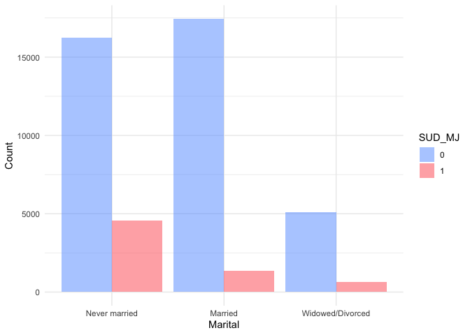
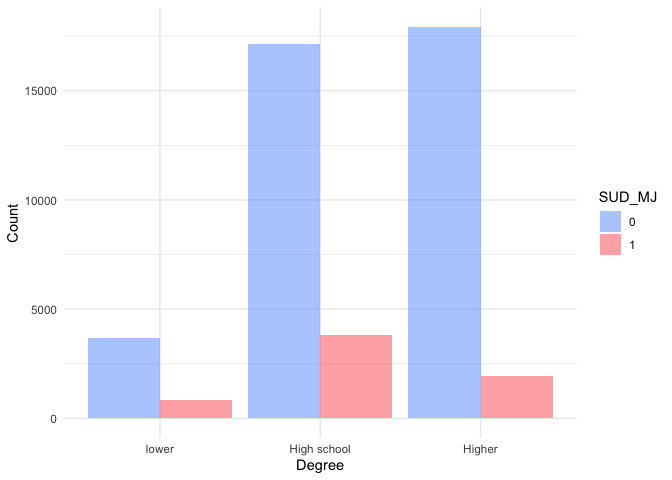
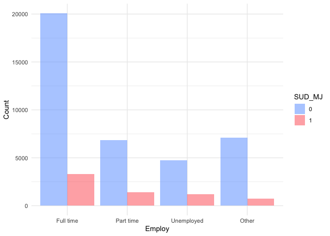
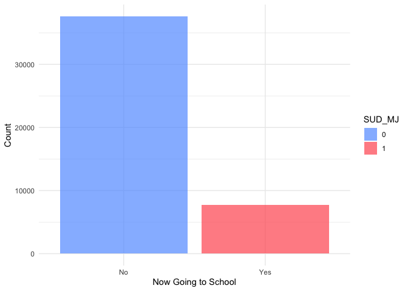
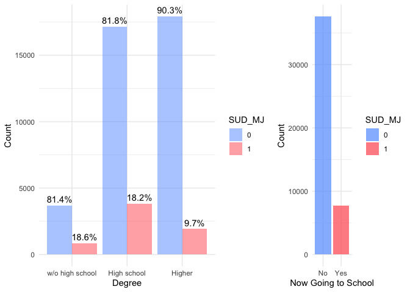
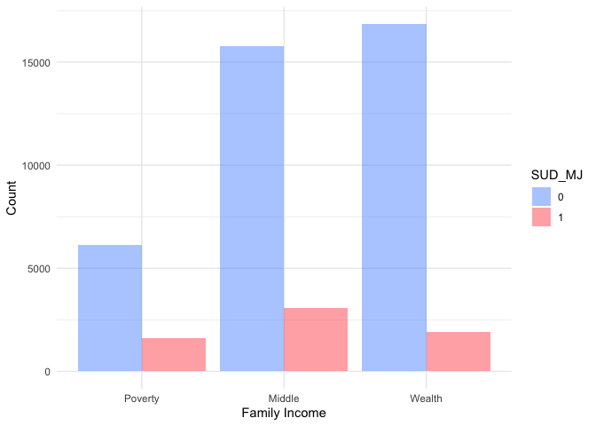
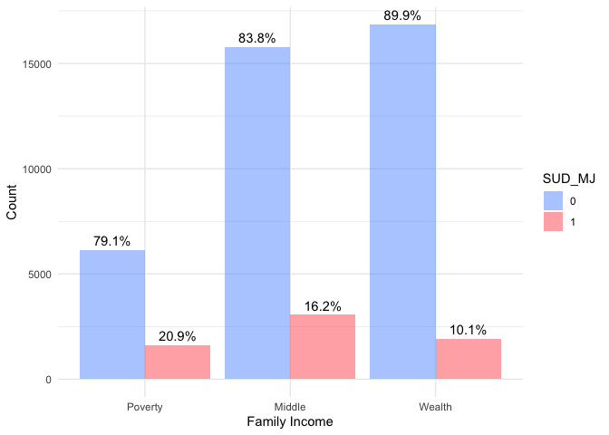
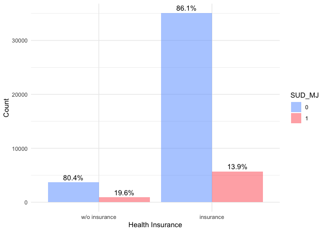

```r
# Load libraries
library(tidyverse)
library(httr)
library(jsonlite)
library(foreach)
library(psych)
library(patchwork)
library(plotly)
library(dplyr)
library(readr)
library(gt) # for better table output
library(gridExtra)
```

# Introduction 

Based on the previous group project, we changed some methods. 

# Data

The data utilized in this project comes from the 2022 National Survey on Drug Use and Health (NSDUH) Releases. This survey provides nationally representative data on tobacco, alcohol, and drug use; substance use disorders; mental health issues; and the receipt of substance use and mental health treatment among the civilian, non-institutionalized population aged 12 and older in the United States. Compared to the 2021 NSDUH data, the 2022 version updated questions related to substance use treatment and mental health treatment, vaping of nicotine and marijuana, different methods of marijuana use, and the use of illegally made fentanyl (IMF). Most importantly, the 2022 NSDUH data is less affected by the COVID-19 pandemic than the 2021 data, which was a significant consideration in our previous project. In-person data collection for the 2022 NSDUH was only restricted in January 2022, resulting in a higher proportion of in-person interviews in 2022 compared to 2021.


```r
# Load data -- NSDUH 2022
load("/Users/jiashuliu/Desktop/Projects/substance_use_disorder/data/NSDUH_2022.RData")
sud_2022 <- read_csv("/Users/jiashuliu/Desktop/Projects/substance_use_disorder/data/sud_2022.csv")
```

### Outcome Variable 

The outcome variable SUD_MJ is based on the DSM-5 Diagnostic Criteria for diagnosing and classifying substance use disorders. I reviewed questions from the marijuana use disorder section of the 2022 NSDUH data and identified the most relevant questions corresponding to the DSM-5 criteria. An SUD_MJ value of 1 indicates that the respondent has some level of marijuana use disorder, while a value of 0 indicates the absence of such a disorder. 


```r
# If any of the "udmj" variables have a value of 1, we set SUD_MJ as 1, otherwise SUD_MJ is 0.
NSDUH_2022_full <- NSDUH_2022 %>%
  mutate(across(starts_with("udmj"), 
                ~if_else(. %in% c(1, 2), 
                         if_else(. == 1, 1, 0), 
                         NA))) %>% 
  select(-"udmjavwothr") %>% 
  mutate(SUD_MJ = rowSums(select(., starts_with("udmj")), na.rm = TRUE)>=1, 
         SUD_MJ = if_else(SUD_MJ, 1, 0))
```

### Predictors

There are 14 selected predictors, including age, sex, race, whether the respondent has health problems, marital status, highest degree obtained, school attendance, employment status, number of people in the household, number of children under 18 in the household, number of elderly people over 65 in the household, health insurance status, family income level, and mental health status.

All the socio-demographic variables in the survey are provided as categorical variables with various levels. I followed the methodology used in the original survey data but reorganized some variables into more general levels to make the data easier to analyze and interpret. For example, the predictor age (AGE3 in the survey data) originally had 10 levels. I consolidated these into four levels: 1 represents adolescents under age 18, 2 represents young adults aged 18 to 29, 3 indicates middle-aged individuals aged 30 to 64, and 4 represents elderly individuals aged 65 and older. The final cleaned dataset 


```r
codebook = data.frame(Variable = c("Age", "Sex", "Race", "Health", "Marital", "Degree", "Now going to school or not?", "Employment", "Persons in Household", "Kids age<18 in Household", "Elderly age>65 in Household", "Health Insurance", "Income: family income", "Mentalhealth: combined score of K6 questions"), 
                      Meaning = c("1=Adolescent: 18-, 2=Young Adult: 18-29, 3=Middle Age: 30-64, 4=Elderly: 65+", "0=Female, 1=Male", "1=NonHisp White, 2=NonHisp Black/Afr Am, 3=NonHisp Native Am/AK Native, 4=NonHisp Native HI/Other Pac Isl, 5=NonHisp Asian, 6=NonHisp more than one race, 7=Hispanic", "0=w/o health problem: excellent/very good/good, 1=with health problem: fair/poor", "0=never been married/cannot married<=14, 1=married, 2=widowed/divorced/separated", "1=w/o high school, 2=high school degree, 3=associate's degree/college graduate or higher", "1/11 = now going to school,  0=No, other is NA", "1=employed full time, 2=employed part time, 3=unemployed, 4=Other(incl. not in labor force)", "range 1-5, 6=6 or more people in household", "0=No children under 18 , 1=One child under 18, 2=Two children under 18, 3=Three or more children under 18.", "0=No people 65 or older in household, 1 = One person 65 or older in household, 2 = Two or more people 65 or older in household", "0=w/o health insurance, 1=health insurance", "1=poverty:20000-, 2=middle:74999-, 3=wealth:75000+", "range = 0 - 24, na:Aged 12-17"))
codebook %>%
  gt() %>%
  tab_header(
    title = md("**Codebook**")
  ) %>%
  tab_style(
    style = cell_fill(color = "aliceblue"),
    locations = cells_body(
      rows = Variable %in% c("Age", "Race", "Marital", "Now going to school or not?", "Persons in Household", "Elderly age>65 in Household", "Income: family income"))
  ) %>%
  tab_style(
    style = cell_fill(color = "skyblue"),
    locations = cells_body(
      rows = !(Variable %in% c("Age", "Race", "Marital", "Now going to school or not?", "Persons in Household", "Elderly age>65 in Household", "Income: family income"))
    )
  ) %>%
  tab_options(
    table.font.size = px(13L)
  )
```

```{=html}
<div id="inozltzlso" style="padding-left:0px;padding-right:0px;padding-top:10px;padding-bottom:10px;overflow-x:auto;overflow-y:auto;width:auto;height:auto;">
<style>#inozltzlso table {
  font-family: system-ui, 'Segoe UI', Roboto, Helvetica, Arial, sans-serif, 'Apple Color Emoji', 'Segoe UI Emoji', 'Segoe UI Symbol', 'Noto Color Emoji';
  -webkit-font-smoothing: antialiased;
  -moz-osx-font-smoothing: grayscale;
}

#inozltzlso thead, #inozltzlso tbody, #inozltzlso tfoot, #inozltzlso tr, #inozltzlso td, #inozltzlso th {
  border-style: none;
}

#inozltzlso p {
  margin: 0;
  padding: 0;
}

#inozltzlso .gt_table {
  display: table;
  border-collapse: collapse;
  line-height: normal;
  margin-left: auto;
  margin-right: auto;
  color: #333333;
  font-size: 13px;
  font-weight: normal;
  font-style: normal;
  background-color: #FFFFFF;
  width: auto;
  border-top-style: solid;
  border-top-width: 2px;
  border-top-color: #A8A8A8;
  border-right-style: none;
  border-right-width: 2px;
  border-right-color: #D3D3D3;
  border-bottom-style: solid;
  border-bottom-width: 2px;
  border-bottom-color: #A8A8A8;
  border-left-style: none;
  border-left-width: 2px;
  border-left-color: #D3D3D3;
}

#inozltzlso .gt_caption {
  padding-top: 4px;
  padding-bottom: 4px;
}

#inozltzlso .gt_title {
  color: #333333;
  font-size: 125%;
  font-weight: initial;
  padding-top: 4px;
  padding-bottom: 4px;
  padding-left: 5px;
  padding-right: 5px;
  border-bottom-color: #FFFFFF;
  border-bottom-width: 0;
}

#inozltzlso .gt_subtitle {
  color: #333333;
  font-size: 85%;
  font-weight: initial;
  padding-top: 3px;
  padding-bottom: 5px;
  padding-left: 5px;
  padding-right: 5px;
  border-top-color: #FFFFFF;
  border-top-width: 0;
}

#inozltzlso .gt_heading {
  background-color: #FFFFFF;
  text-align: center;
  border-bottom-color: #FFFFFF;
  border-left-style: none;
  border-left-width: 1px;
  border-left-color: #D3D3D3;
  border-right-style: none;
  border-right-width: 1px;
  border-right-color: #D3D3D3;
}

#inozltzlso .gt_bottom_border {
  border-bottom-style: solid;
  border-bottom-width: 2px;
  border-bottom-color: #D3D3D3;
}

#inozltzlso .gt_col_headings {
  border-top-style: solid;
  border-top-width: 2px;
  border-top-color: #D3D3D3;
  border-bottom-style: solid;
  border-bottom-width: 2px;
  border-bottom-color: #D3D3D3;
  border-left-style: none;
  border-left-width: 1px;
  border-left-color: #D3D3D3;
  border-right-style: none;
  border-right-width: 1px;
  border-right-color: #D3D3D3;
}

#inozltzlso .gt_col_heading {
  color: #333333;
  background-color: #FFFFFF;
  font-size: 100%;
  font-weight: normal;
  text-transform: inherit;
  border-left-style: none;
  border-left-width: 1px;
  border-left-color: #D3D3D3;
  border-right-style: none;
  border-right-width: 1px;
  border-right-color: #D3D3D3;
  vertical-align: bottom;
  padding-top: 5px;
  padding-bottom: 6px;
  padding-left: 5px;
  padding-right: 5px;
  overflow-x: hidden;
}

#inozltzlso .gt_column_spanner_outer {
  color: #333333;
  background-color: #FFFFFF;
  font-size: 100%;
  font-weight: normal;
  text-transform: inherit;
  padding-top: 0;
  padding-bottom: 0;
  padding-left: 4px;
  padding-right: 4px;
}

#inozltzlso .gt_column_spanner_outer:first-child {
  padding-left: 0;
}

#inozltzlso .gt_column_spanner_outer:last-child {
  padding-right: 0;
}

#inozltzlso .gt_column_spanner {
  border-bottom-style: solid;
  border-bottom-width: 2px;
  border-bottom-color: #D3D3D3;
  vertical-align: bottom;
  padding-top: 5px;
  padding-bottom: 5px;
  overflow-x: hidden;
  display: inline-block;
  width: 100%;
}

#inozltzlso .gt_spanner_row {
  border-bottom-style: hidden;
}

#inozltzlso .gt_group_heading {
  padding-top: 8px;
  padding-bottom: 8px;
  padding-left: 5px;
  padding-right: 5px;
  color: #333333;
  background-color: #FFFFFF;
  font-size: 100%;
  font-weight: initial;
  text-transform: inherit;
  border-top-style: solid;
  border-top-width: 2px;
  border-top-color: #D3D3D3;
  border-bottom-style: solid;
  border-bottom-width: 2px;
  border-bottom-color: #D3D3D3;
  border-left-style: none;
  border-left-width: 1px;
  border-left-color: #D3D3D3;
  border-right-style: none;
  border-right-width: 1px;
  border-right-color: #D3D3D3;
  vertical-align: middle;
  text-align: left;
}

#inozltzlso .gt_empty_group_heading {
  padding: 0.5px;
  color: #333333;
  background-color: #FFFFFF;
  font-size: 100%;
  font-weight: initial;
  border-top-style: solid;
  border-top-width: 2px;
  border-top-color: #D3D3D3;
  border-bottom-style: solid;
  border-bottom-width: 2px;
  border-bottom-color: #D3D3D3;
  vertical-align: middle;
}

#inozltzlso .gt_from_md > :first-child {
  margin-top: 0;
}

#inozltzlso .gt_from_md > :last-child {
  margin-bottom: 0;
}

#inozltzlso .gt_row {
  padding-top: 8px;
  padding-bottom: 8px;
  padding-left: 5px;
  padding-right: 5px;
  margin: 10px;
  border-top-style: solid;
  border-top-width: 1px;
  border-top-color: #D3D3D3;
  border-left-style: none;
  border-left-width: 1px;
  border-left-color: #D3D3D3;
  border-right-style: none;
  border-right-width: 1px;
  border-right-color: #D3D3D3;
  vertical-align: middle;
  overflow-x: hidden;
}

#inozltzlso .gt_stub {
  color: #333333;
  background-color: #FFFFFF;
  font-size: 100%;
  font-weight: initial;
  text-transform: inherit;
  border-right-style: solid;
  border-right-width: 2px;
  border-right-color: #D3D3D3;
  padding-left: 5px;
  padding-right: 5px;
}

#inozltzlso .gt_stub_row_group {
  color: #333333;
  background-color: #FFFFFF;
  font-size: 100%;
  font-weight: initial;
  text-transform: inherit;
  border-right-style: solid;
  border-right-width: 2px;
  border-right-color: #D3D3D3;
  padding-left: 5px;
  padding-right: 5px;
  vertical-align: top;
}

#inozltzlso .gt_row_group_first td {
  border-top-width: 2px;
}

#inozltzlso .gt_row_group_first th {
  border-top-width: 2px;
}

#inozltzlso .gt_summary_row {
  color: #333333;
  background-color: #FFFFFF;
  text-transform: inherit;
  padding-top: 8px;
  padding-bottom: 8px;
  padding-left: 5px;
  padding-right: 5px;
}

#inozltzlso .gt_first_summary_row {
  border-top-style: solid;
  border-top-color: #D3D3D3;
}

#inozltzlso .gt_first_summary_row.thick {
  border-top-width: 2px;
}

#inozltzlso .gt_last_summary_row {
  padding-top: 8px;
  padding-bottom: 8px;
  padding-left: 5px;
  padding-right: 5px;
  border-bottom-style: solid;
  border-bottom-width: 2px;
  border-bottom-color: #D3D3D3;
}

#inozltzlso .gt_grand_summary_row {
  color: #333333;
  background-color: #FFFFFF;
  text-transform: inherit;
  padding-top: 8px;
  padding-bottom: 8px;
  padding-left: 5px;
  padding-right: 5px;
}

#inozltzlso .gt_first_grand_summary_row {
  padding-top: 8px;
  padding-bottom: 8px;
  padding-left: 5px;
  padding-right: 5px;
  border-top-style: double;
  border-top-width: 6px;
  border-top-color: #D3D3D3;
}

#inozltzlso .gt_last_grand_summary_row_top {
  padding-top: 8px;
  padding-bottom: 8px;
  padding-left: 5px;
  padding-right: 5px;
  border-bottom-style: double;
  border-bottom-width: 6px;
  border-bottom-color: #D3D3D3;
}

#inozltzlso .gt_striped {
  background-color: rgba(128, 128, 128, 0.05);
}

#inozltzlso .gt_table_body {
  border-top-style: solid;
  border-top-width: 2px;
  border-top-color: #D3D3D3;
  border-bottom-style: solid;
  border-bottom-width: 2px;
  border-bottom-color: #D3D3D3;
}

#inozltzlso .gt_footnotes {
  color: #333333;
  background-color: #FFFFFF;
  border-bottom-style: none;
  border-bottom-width: 2px;
  border-bottom-color: #D3D3D3;
  border-left-style: none;
  border-left-width: 2px;
  border-left-color: #D3D3D3;
  border-right-style: none;
  border-right-width: 2px;
  border-right-color: #D3D3D3;
}

#inozltzlso .gt_footnote {
  margin: 0px;
  font-size: 90%;
  padding-top: 4px;
  padding-bottom: 4px;
  padding-left: 5px;
  padding-right: 5px;
}

#inozltzlso .gt_sourcenotes {
  color: #333333;
  background-color: #FFFFFF;
  border-bottom-style: none;
  border-bottom-width: 2px;
  border-bottom-color: #D3D3D3;
  border-left-style: none;
  border-left-width: 2px;
  border-left-color: #D3D3D3;
  border-right-style: none;
  border-right-width: 2px;
  border-right-color: #D3D3D3;
}

#inozltzlso .gt_sourcenote {
  font-size: 90%;
  padding-top: 4px;
  padding-bottom: 4px;
  padding-left: 5px;
  padding-right: 5px;
}

#inozltzlso .gt_left {
  text-align: left;
}

#inozltzlso .gt_center {
  text-align: center;
}

#inozltzlso .gt_right {
  text-align: right;
  font-variant-numeric: tabular-nums;
}

#inozltzlso .gt_font_normal {
  font-weight: normal;
}

#inozltzlso .gt_font_bold {
  font-weight: bold;
}

#inozltzlso .gt_font_italic {
  font-style: italic;
}

#inozltzlso .gt_super {
  font-size: 65%;
}

#inozltzlso .gt_footnote_marks {
  font-size: 75%;
  vertical-align: 0.4em;
  position: initial;
}

#inozltzlso .gt_asterisk {
  font-size: 100%;
  vertical-align: 0;
}

#inozltzlso .gt_indent_1 {
  text-indent: 5px;
}

#inozltzlso .gt_indent_2 {
  text-indent: 10px;
}

#inozltzlso .gt_indent_3 {
  text-indent: 15px;
}

#inozltzlso .gt_indent_4 {
  text-indent: 20px;
}

#inozltzlso .gt_indent_5 {
  text-indent: 25px;
}
</style>
<table class="gt_table" data-quarto-disable-processing="false" data-quarto-bootstrap="false">
  <thead>
    <tr class="gt_heading">
      <td colspan="2" class="gt_heading gt_title gt_font_normal gt_bottom_border" style><strong>Codebook</strong></td>
    </tr>
    
    <tr class="gt_col_headings">
      <th class="gt_col_heading gt_columns_bottom_border gt_left" rowspan="1" colspan="1" scope="col" id="Variable">Variable</th>
      <th class="gt_col_heading gt_columns_bottom_border gt_left" rowspan="1" colspan="1" scope="col" id="Meaning">Meaning</th>
    </tr>
  </thead>
  <tbody class="gt_table_body">
    <tr><td headers="Variable" class="gt_row gt_left" style="background-color: #F0F8FF;">Age</td>
<td headers="Meaning" class="gt_row gt_left" style="background-color: #F0F8FF;">1=Adolescent: 18-, 2=Young Adult: 18-29, 3=Middle Age: 30-64, 4=Elderly: 65+</td></tr>
    <tr><td headers="Variable" class="gt_row gt_left" style="background-color: #87CEEB;">Sex</td>
<td headers="Meaning" class="gt_row gt_left" style="background-color: #87CEEB;">0=Female, 1=Male</td></tr>
    <tr><td headers="Variable" class="gt_row gt_left" style="background-color: #F0F8FF;">Race</td>
<td headers="Meaning" class="gt_row gt_left" style="background-color: #F0F8FF;">1=NonHisp White, 2=NonHisp Black/Afr Am, 3=NonHisp Native Am/AK Native, 4=NonHisp Native HI/Other Pac Isl, 5=NonHisp Asian, 6=NonHisp more than one race, 7=Hispanic</td></tr>
    <tr><td headers="Variable" class="gt_row gt_left" style="background-color: #87CEEB;">Health</td>
<td headers="Meaning" class="gt_row gt_left" style="background-color: #87CEEB;">0=w/o health problem: excellent/very good/good, 1=with health problem: fair/poor</td></tr>
    <tr><td headers="Variable" class="gt_row gt_left" style="background-color: #F0F8FF;">Marital</td>
<td headers="Meaning" class="gt_row gt_left" style="background-color: #F0F8FF;">0=never been married/cannot married&lt;=14, 1=married, 2=widowed/divorced/separated</td></tr>
    <tr><td headers="Variable" class="gt_row gt_left" style="background-color: #87CEEB;">Degree</td>
<td headers="Meaning" class="gt_row gt_left" style="background-color: #87CEEB;">1=w/o high school, 2=high school degree, 3=associate's degree/college graduate or higher</td></tr>
    <tr><td headers="Variable" class="gt_row gt_left" style="background-color: #F0F8FF;">Now going to school or not?</td>
<td headers="Meaning" class="gt_row gt_left" style="background-color: #F0F8FF;">1/11 = now going to school,  0=No, other is NA</td></tr>
    <tr><td headers="Variable" class="gt_row gt_left" style="background-color: #87CEEB;">Employment</td>
<td headers="Meaning" class="gt_row gt_left" style="background-color: #87CEEB;">1=employed full time, 2=employed part time, 3=unemployed, 4=Other(incl. not in labor force)</td></tr>
    <tr><td headers="Variable" class="gt_row gt_left" style="background-color: #F0F8FF;">Persons in Household</td>
<td headers="Meaning" class="gt_row gt_left" style="background-color: #F0F8FF;">range 1-5, 6=6 or more people in household</td></tr>
    <tr><td headers="Variable" class="gt_row gt_left" style="background-color: #87CEEB;">Kids age&lt;18 in Household</td>
<td headers="Meaning" class="gt_row gt_left" style="background-color: #87CEEB;">0=No children under 18 , 1=One child under 18, 2=Two children under 18, 3=Three or more children under 18.</td></tr>
    <tr><td headers="Variable" class="gt_row gt_left" style="background-color: #F0F8FF;">Elderly age&gt;65 in Household</td>
<td headers="Meaning" class="gt_row gt_left" style="background-color: #F0F8FF;">0=No people 65 or older in household, 1 = One person 65 or older in household, 2 = Two or more people 65 or older in household</td></tr>
    <tr><td headers="Variable" class="gt_row gt_left" style="background-color: #87CEEB;">Health Insurance</td>
<td headers="Meaning" class="gt_row gt_left" style="background-color: #87CEEB;">0=w/o health insurance, 1=health insurance</td></tr>
    <tr><td headers="Variable" class="gt_row gt_left" style="background-color: #F0F8FF;">Income: family income</td>
<td headers="Meaning" class="gt_row gt_left" style="background-color: #F0F8FF;">1=poverty:20000-, 2=middle:74999-, 3=wealth:75000+</td></tr>
    <tr><td headers="Variable" class="gt_row gt_left" style="background-color: #87CEEB;">Mentalhealth: combined score of K6 questions</td>
<td headers="Meaning" class="gt_row gt_left" style="background-color: #87CEEB;">range = 0 - 24, na:Aged 12-17</td></tr>
  </tbody>
  
  
</table>
</div>
```


```r
# Predictors -- Demographics
# 1) age (1=Adolescent: 18-, 2=Young Adult: 18-29, 3=Middle Age: 30-64, 4=Elderly: 65+)
NSDUH_2022_full <- NSDUH_2022_full %>% 
  mutate(age = case_when(AGE3 %in% c(1:3) ~ 1,
                         AGE3 %in% c(4:8) ~ 2,
                         AGE3 %in% c(9:10) ~ 3,
                         TRUE ~ 4))
# 2) sex (0=Female, 1=Male)
NSDUH_2022_full <- NSDUH_2022_full %>% 
  mutate(sex = if_else(irsex == 2,0,1))

# 3) race (1=NonHisp White, 2=NonHisp Black/Afr Am, 3=NonHisp Native Am/AK Native, 4=NonHisp Native HI/Other Pac Isl, 5=NonHisp Asian, 6=NonHisp more than one race, 7=Hispanic)
NSDUH_2022_full <- NSDUH_2022_full %>% 
  mutate(race = NEWRACE2)
  #mutate(race = case_when(NEWRACE2 %in% c(2:6) ~ 2,
                         # NEWRACE2 == 7 ~ 3,
                          #TRUE ~ 1))

# 4) health (0=w/o health problem: excellent/very good/good, 1=with health problem: fair/poor)
NSDUH_2022_full <- NSDUH_2022_full %>% 
  mutate(health = case_when(health %in% c(1:3) ~ 0,
                            health %in% c(4:5) ~ 1,
                            TRUE ~ NA))

# 5) marital (0=never been married/cannot married<=14, 1=married, 2=widowed/divorced/separated)
NSDUH_2022_full <- NSDUH_2022_full %>% 
  mutate(marital = case_when(irmarit %in% c(4,99) ~ 0,
                             irmarit %in% c(2:3) ~ 2,
                             TRUE ~ 1))
```


```r
# Predictors -- Education
# 6) degree (1=w/o high school, 2=high school degree, 3=associate's degree/college graduate or higher)
NSDUH_2022_full <- NSDUH_2022_full %>% 
  mutate(degree = case_when(IREDUHIGHST2 %in% c(1:7) ~ 1,
                            IREDUHIGHST2 %in% c(8:9) ~ 2,
                            TRUE ~ 3))

# 7) Now going to school or not? (1/11 = now going to school,  0=No, other is NA)
NSDUH_2022_full <- NSDUH_2022_full %>% 
  mutate(student = case_when(eduschlgo %in% c(1, 11) ~ 1,
                             eduschlgo == 2 ~ 0,
                             TRUE ~ NA))
```


```r
# Predictors: Employment and Houshold Composition
# 8) employ (1=employed full time, 2=employed part time, 3=unemployed, 4=Other(incl. not in labor force))
NSDUH_2022_full <- NSDUH_2022_full %>% 
  mutate(employ = case_when(WRKSTATWK2 %in% c(1,6) ~ 1,
                            WRKSTATWK2 %in% c(2:3) ~ 2,
                            WRKSTATWK2 %in% c(4,9) ~ 3,
                            TRUE ~ 4))

# 9) persons in household (range 1-5, 6=6 or more people in household)
NSDUH_2022_full <- NSDUH_2022_full %>% mutate(family = IRHHSIZ2)

# 10) kids age<18 in Household
# 0 = No children under 18 
# 1 = One child under 18
# 2 = Two children under 18 
# 3 = Three or more children under 18.
NSDUH_2022_full <- NSDUH_2022_full %>% mutate(kid = IRKI17_2 - 1)

# 11) elderly age>65 in Household (range 0-1, 2=2 or more elders in household)
# 0 = No people 65 or older in household
# 1 = One person 65 or older in household
# 2 = Two or more people 65 or older in household
NSDUH_2022_full <- NSDUH_2022_full %>% mutate(elderly = IRHH65_2-1)
```


```r
# Predictors: Health and Income 
# 12) health_insur (0=w/o health insurance, 1=health insurance)
NSDUH_2022_full <- NSDUH_2022_full %>% 
  mutate(health_insur = case_when(
    irmedicr == 1 | irmcdchp == 1 | irchmpus == 1 | irprvhlt == 1 ~ 1,
    irothhlt == 1 ~ 1,
    irothhlt == 2 ~ 0,
    irothhlt == 99 ~ NA,
    TRUE ~ 0
  ))

# 13) income: family income (1=poverty:20000-, 2=middle:74999-, 3=wealth:75000+)
NSDUH_2022_full <- NSDUH_2022_full %>% 
  mutate(income = case_when(IRFAMIN3 %in% c(1:2) ~ 1,
                            IRFAMIN3 %in% c(3:6) ~ 2,
                            TRUE ~ 3))

# 14) mentalhealth: combined score of K6 questions (range = 0 - 24, na:Aged 12-17) 
NSDUH_2022_full <- NSDUH_2022_full %>% 
  mutate(k1 = case_when(IRDSTCHR30 == 1 ~ 4,
                         IRDSTCHR30 == 2 ~ 3,
                         IRDSTCHR30 == 3 ~ 2,
                         IRDSTCHR30 == 4 ~ 1,
                         IRDSTCHR30 == 5 ~ 0,
                         TRUE ~ 99),
         k2 = case_when(IRDSTEFF30 == 1 ~ 4,
                         IRDSTEFF30 == 2 ~ 3,
                         IRDSTEFF30 == 3 ~ 2,
                         IRDSTEFF30 == 4 ~ 1,
                         IRDSTEFF30 == 5 ~ 0,
                         TRUE ~ 99),
         k3 = case_when(IRDSTHOP30 == 1 ~ 4,
                         IRDSTHOP30 == 2 ~ 3,
                         IRDSTHOP30 == 3 ~ 2,
                         IRDSTHOP30 == 4 ~ 1,
                         IRDSTHOP30 == 5 ~ 0,
                         TRUE ~ 99),
         k4 = case_when(IRDSTNGD30 == 1 ~ 4,
                         IRDSTNGD30 == 2 ~ 3,
                         IRDSTNGD30 == 3 ~ 2,
                         IRDSTNGD30 == 4 ~ 1,
                         IRDSTNGD30 == 5 ~ 0,
                         TRUE ~ 99),
         k5 = case_when(IRDSTNRV30 == 1 ~ 4,
                         IRDSTNRV30 == 2 ~ 3,
                         IRDSTNRV30 == 3 ~ 2,
                         IRDSTNRV30 == 4 ~ 1,
                         IRDSTNRV30 == 5 ~ 0,
                         TRUE ~ 99),
         k6 = case_when(IRDSTRST30 == 1 ~ 4,
                         IRDSTRST30 == 2 ~ 3,
                         IRDSTRST30 == 3 ~ 2,
                         IRDSTRST30 == 4 ~ 1,
                         IRDSTRST30 == 5 ~ 0,
                         TRUE ~ 99),
         mentalhealth = case_when(k1 == 99 | k2 == 99 | k3 == 99 | k4 == 99 | 
                                    k5 == 99 | k6 == 99 ~  NA,
                                  TRUE ~ k1+k2+k3+k4+k5+k6))
# For each of the six items listed above, responses of "all of the time" were coded 4, 
#"most of the time" were coded 3, "some of the time" were coded 2, "a little of the time" 
#were coded 1, and "none of the time" were coded 0. These assigned values were summed 
#across the six items to calculate a total score for mentalhealth.
```


```r
# Create new dataset and drop all the NA values
data_cleaned <- NSDUH_2022_full %>%
  select(age, sex, race, health, marital, degree, 
         student, employ, family, kid, elderly, health_insur, 
         income, mentalhealth, SUD_MJ) %>%
  drop_na()
# check NAs
# anyNA(data_cleaned)
# New csv file
# write_csv(data_cleaned,"/Users/jiashuliu/Desktop/Projects/substance_use_disorder/data/sud_2022.csv")
```

# Exploratory Data Analysis

### Data Visualization

**Age**
The bar plot of the age variable indicates that young adults aged 18 to 29 have the highest prevalence of marijuana use disorder.

```r
# age (1=Adolescent: 18-, 2=Young Adult: 18-29, 3=Middle Age: 30-64, 4=Elderly: 65+)
table(sud_2022$age)
```

```
## 
##     2     3     4 
## 23060 17273  4998
```

```r
p1.1 <- sud_2022 %>% 
  ggplot(aes(x = factor(age, levels = 1:4, labels = c("Adolescent", "Young Adult", "Middle Age","Elderly")), fill = factor(SUD_MJ))) +
  geom_bar(alpha = 0.5, position = "dodge") +
  scale_fill_manual(values = c("#619CFF", "#FF595E"),name = "SUD_MJ") +
  labs(x = "age", y = "Count") +
  theme_minimal()
p1.1
```

<!-- -->

**Sex**

From the bar plot, we can see that the percentage of males having a marijuana use disorder in 2022 is slightly higher than that of females, with 17% of males and 12.5% of females affected.

```r
# Calculate the percentage of SUD_MJ for each sex and each level of SUD_MJ
percentage <- sud_2022 %>%
  group_by(sex, SUD_MJ) %>%
  summarize(count = n()) %>%
  mutate(percentage = count / sum(count) * 100)

percentage <- percentage %>%
  mutate(sex = factor(sex, levels = c(0, 1), labels = c("Female", "Male")),
         SUD_MJ = factor(SUD_MJ, levels = c(0, 1), labels = c("0", "1")))

# Plot SUD_MJ percentages in each gender group
p2 <- sud_2022 %>%
  ggplot(aes(x = factor(sex, levels = c(0, 1), labels = c("Female", "Male")), fill = factor(SUD_MJ))) +
  geom_bar(alpha = 0.5, position = "dodge") +
  scale_fill_manual(values = c("#619CFF", "#FF595E"), name = "SUD_MJ") +
  labs(x = "Sex", y = "Count") +
  theme_minimal() +
  geom_text(data = percentage, aes(x = sex, y = count, label = paste0(round(percentage, 1), "%")),
            position = position_dodge(width = 0.9), vjust = -0.5)

p2
```

<!-- -->

**Race**
The following table summarizes the distribution of marijuana use disorder (SUD_MJ) among different racial groups. The count and percentage are provided for each combination of race and SUD_MJ status. The "NonHisp Asian" group has the lowest percentage (5.2%) of individuals with SUD_MJ, while the "NonHisp Native Am/AK Native" group has the highest percentage (27.3%). The "NonHisp White" group has the second-lowest percentage (13.7%) of individuals with SUD_MJ, and the "NonHisp More Than One Race" group has the second-highest percentage (23.1%). The "NonHisp Black/Afr Am" group has a percentage of 17.9% of individuals with SUD_MJ, which is higher than the "Hispanic" group, which has 15.1% of individuals with SUD_MJ.

```r
race_dat <- sud_2022 %>%
  mutate(race = factor(race, levels = 1:7, labels = c("NonHisp White", "NonHisp Black/Afr Am", "NonHisp Native Am/AK Native", "NonHisp Native HI/Other Pac Isl", "NonHisp Asian", "NonHisp more than one race", "Hispanic")))
race_summary <- race_dat %>%
  group_by(race, SUD_MJ) %>%
  summarize(count = n(), .groups = 'drop') %>%
  group_by(race) %>%
  mutate(percentage = round(count / sum(count) * 100, 1)) %>%
  ungroup()
highlighted_table <- race_summary %>%
  gt() %>%
  tab_style(
    style = cell_fill(color = "lightyellow"),
    locations = cells_body(
      rows = race == "NonHisp Native Am/AK Native" & SUD_MJ == 1
    )
  ) %>% 
  tab_style(
    style = cell_fill(color = "honeydew"),
    locations = cells_body(
      rows = race == "NonHisp Asian" & SUD_MJ == 1
    )
  )
highlighted_table
```

```{=html}
<div id="dlenympjkx" style="padding-left:0px;padding-right:0px;padding-top:10px;padding-bottom:10px;overflow-x:auto;overflow-y:auto;width:auto;height:auto;">
<style>#dlenympjkx table {
  font-family: system-ui, 'Segoe UI', Roboto, Helvetica, Arial, sans-serif, 'Apple Color Emoji', 'Segoe UI Emoji', 'Segoe UI Symbol', 'Noto Color Emoji';
  -webkit-font-smoothing: antialiased;
  -moz-osx-font-smoothing: grayscale;
}

#dlenympjkx thead, #dlenympjkx tbody, #dlenympjkx tfoot, #dlenympjkx tr, #dlenympjkx td, #dlenympjkx th {
  border-style: none;
}

#dlenympjkx p {
  margin: 0;
  padding: 0;
}

#dlenympjkx .gt_table {
  display: table;
  border-collapse: collapse;
  line-height: normal;
  margin-left: auto;
  margin-right: auto;
  color: #333333;
  font-size: 16px;
  font-weight: normal;
  font-style: normal;
  background-color: #FFFFFF;
  width: auto;
  border-top-style: solid;
  border-top-width: 2px;
  border-top-color: #A8A8A8;
  border-right-style: none;
  border-right-width: 2px;
  border-right-color: #D3D3D3;
  border-bottom-style: solid;
  border-bottom-width: 2px;
  border-bottom-color: #A8A8A8;
  border-left-style: none;
  border-left-width: 2px;
  border-left-color: #D3D3D3;
}

#dlenympjkx .gt_caption {
  padding-top: 4px;
  padding-bottom: 4px;
}

#dlenympjkx .gt_title {
  color: #333333;
  font-size: 125%;
  font-weight: initial;
  padding-top: 4px;
  padding-bottom: 4px;
  padding-left: 5px;
  padding-right: 5px;
  border-bottom-color: #FFFFFF;
  border-bottom-width: 0;
}

#dlenympjkx .gt_subtitle {
  color: #333333;
  font-size: 85%;
  font-weight: initial;
  padding-top: 3px;
  padding-bottom: 5px;
  padding-left: 5px;
  padding-right: 5px;
  border-top-color: #FFFFFF;
  border-top-width: 0;
}

#dlenympjkx .gt_heading {
  background-color: #FFFFFF;
  text-align: center;
  border-bottom-color: #FFFFFF;
  border-left-style: none;
  border-left-width: 1px;
  border-left-color: #D3D3D3;
  border-right-style: none;
  border-right-width: 1px;
  border-right-color: #D3D3D3;
}

#dlenympjkx .gt_bottom_border {
  border-bottom-style: solid;
  border-bottom-width: 2px;
  border-bottom-color: #D3D3D3;
}

#dlenympjkx .gt_col_headings {
  border-top-style: solid;
  border-top-width: 2px;
  border-top-color: #D3D3D3;
  border-bottom-style: solid;
  border-bottom-width: 2px;
  border-bottom-color: #D3D3D3;
  border-left-style: none;
  border-left-width: 1px;
  border-left-color: #D3D3D3;
  border-right-style: none;
  border-right-width: 1px;
  border-right-color: #D3D3D3;
}

#dlenympjkx .gt_col_heading {
  color: #333333;
  background-color: #FFFFFF;
  font-size: 100%;
  font-weight: normal;
  text-transform: inherit;
  border-left-style: none;
  border-left-width: 1px;
  border-left-color: #D3D3D3;
  border-right-style: none;
  border-right-width: 1px;
  border-right-color: #D3D3D3;
  vertical-align: bottom;
  padding-top: 5px;
  padding-bottom: 6px;
  padding-left: 5px;
  padding-right: 5px;
  overflow-x: hidden;
}

#dlenympjkx .gt_column_spanner_outer {
  color: #333333;
  background-color: #FFFFFF;
  font-size: 100%;
  font-weight: normal;
  text-transform: inherit;
  padding-top: 0;
  padding-bottom: 0;
  padding-left: 4px;
  padding-right: 4px;
}

#dlenympjkx .gt_column_spanner_outer:first-child {
  padding-left: 0;
}

#dlenympjkx .gt_column_spanner_outer:last-child {
  padding-right: 0;
}

#dlenympjkx .gt_column_spanner {
  border-bottom-style: solid;
  border-bottom-width: 2px;
  border-bottom-color: #D3D3D3;
  vertical-align: bottom;
  padding-top: 5px;
  padding-bottom: 5px;
  overflow-x: hidden;
  display: inline-block;
  width: 100%;
}

#dlenympjkx .gt_spanner_row {
  border-bottom-style: hidden;
}

#dlenympjkx .gt_group_heading {
  padding-top: 8px;
  padding-bottom: 8px;
  padding-left: 5px;
  padding-right: 5px;
  color: #333333;
  background-color: #FFFFFF;
  font-size: 100%;
  font-weight: initial;
  text-transform: inherit;
  border-top-style: solid;
  border-top-width: 2px;
  border-top-color: #D3D3D3;
  border-bottom-style: solid;
  border-bottom-width: 2px;
  border-bottom-color: #D3D3D3;
  border-left-style: none;
  border-left-width: 1px;
  border-left-color: #D3D3D3;
  border-right-style: none;
  border-right-width: 1px;
  border-right-color: #D3D3D3;
  vertical-align: middle;
  text-align: left;
}

#dlenympjkx .gt_empty_group_heading {
  padding: 0.5px;
  color: #333333;
  background-color: #FFFFFF;
  font-size: 100%;
  font-weight: initial;
  border-top-style: solid;
  border-top-width: 2px;
  border-top-color: #D3D3D3;
  border-bottom-style: solid;
  border-bottom-width: 2px;
  border-bottom-color: #D3D3D3;
  vertical-align: middle;
}

#dlenympjkx .gt_from_md > :first-child {
  margin-top: 0;
}

#dlenympjkx .gt_from_md > :last-child {
  margin-bottom: 0;
}

#dlenympjkx .gt_row {
  padding-top: 8px;
  padding-bottom: 8px;
  padding-left: 5px;
  padding-right: 5px;
  margin: 10px;
  border-top-style: solid;
  border-top-width: 1px;
  border-top-color: #D3D3D3;
  border-left-style: none;
  border-left-width: 1px;
  border-left-color: #D3D3D3;
  border-right-style: none;
  border-right-width: 1px;
  border-right-color: #D3D3D3;
  vertical-align: middle;
  overflow-x: hidden;
}

#dlenympjkx .gt_stub {
  color: #333333;
  background-color: #FFFFFF;
  font-size: 100%;
  font-weight: initial;
  text-transform: inherit;
  border-right-style: solid;
  border-right-width: 2px;
  border-right-color: #D3D3D3;
  padding-left: 5px;
  padding-right: 5px;
}

#dlenympjkx .gt_stub_row_group {
  color: #333333;
  background-color: #FFFFFF;
  font-size: 100%;
  font-weight: initial;
  text-transform: inherit;
  border-right-style: solid;
  border-right-width: 2px;
  border-right-color: #D3D3D3;
  padding-left: 5px;
  padding-right: 5px;
  vertical-align: top;
}

#dlenympjkx .gt_row_group_first td {
  border-top-width: 2px;
}

#dlenympjkx .gt_row_group_first th {
  border-top-width: 2px;
}

#dlenympjkx .gt_summary_row {
  color: #333333;
  background-color: #FFFFFF;
  text-transform: inherit;
  padding-top: 8px;
  padding-bottom: 8px;
  padding-left: 5px;
  padding-right: 5px;
}

#dlenympjkx .gt_first_summary_row {
  border-top-style: solid;
  border-top-color: #D3D3D3;
}

#dlenympjkx .gt_first_summary_row.thick {
  border-top-width: 2px;
}

#dlenympjkx .gt_last_summary_row {
  padding-top: 8px;
  padding-bottom: 8px;
  padding-left: 5px;
  padding-right: 5px;
  border-bottom-style: solid;
  border-bottom-width: 2px;
  border-bottom-color: #D3D3D3;
}

#dlenympjkx .gt_grand_summary_row {
  color: #333333;
  background-color: #FFFFFF;
  text-transform: inherit;
  padding-top: 8px;
  padding-bottom: 8px;
  padding-left: 5px;
  padding-right: 5px;
}

#dlenympjkx .gt_first_grand_summary_row {
  padding-top: 8px;
  padding-bottom: 8px;
  padding-left: 5px;
  padding-right: 5px;
  border-top-style: double;
  border-top-width: 6px;
  border-top-color: #D3D3D3;
}

#dlenympjkx .gt_last_grand_summary_row_top {
  padding-top: 8px;
  padding-bottom: 8px;
  padding-left: 5px;
  padding-right: 5px;
  border-bottom-style: double;
  border-bottom-width: 6px;
  border-bottom-color: #D3D3D3;
}

#dlenympjkx .gt_striped {
  background-color: rgba(128, 128, 128, 0.05);
}

#dlenympjkx .gt_table_body {
  border-top-style: solid;
  border-top-width: 2px;
  border-top-color: #D3D3D3;
  border-bottom-style: solid;
  border-bottom-width: 2px;
  border-bottom-color: #D3D3D3;
}

#dlenympjkx .gt_footnotes {
  color: #333333;
  background-color: #FFFFFF;
  border-bottom-style: none;
  border-bottom-width: 2px;
  border-bottom-color: #D3D3D3;
  border-left-style: none;
  border-left-width: 2px;
  border-left-color: #D3D3D3;
  border-right-style: none;
  border-right-width: 2px;
  border-right-color: #D3D3D3;
}

#dlenympjkx .gt_footnote {
  margin: 0px;
  font-size: 90%;
  padding-top: 4px;
  padding-bottom: 4px;
  padding-left: 5px;
  padding-right: 5px;
}

#dlenympjkx .gt_sourcenotes {
  color: #333333;
  background-color: #FFFFFF;
  border-bottom-style: none;
  border-bottom-width: 2px;
  border-bottom-color: #D3D3D3;
  border-left-style: none;
  border-left-width: 2px;
  border-left-color: #D3D3D3;
  border-right-style: none;
  border-right-width: 2px;
  border-right-color: #D3D3D3;
}

#dlenympjkx .gt_sourcenote {
  font-size: 90%;
  padding-top: 4px;
  padding-bottom: 4px;
  padding-left: 5px;
  padding-right: 5px;
}

#dlenympjkx .gt_left {
  text-align: left;
}

#dlenympjkx .gt_center {
  text-align: center;
}

#dlenympjkx .gt_right {
  text-align: right;
  font-variant-numeric: tabular-nums;
}

#dlenympjkx .gt_font_normal {
  font-weight: normal;
}

#dlenympjkx .gt_font_bold {
  font-weight: bold;
}

#dlenympjkx .gt_font_italic {
  font-style: italic;
}

#dlenympjkx .gt_super {
  font-size: 65%;
}

#dlenympjkx .gt_footnote_marks {
  font-size: 75%;
  vertical-align: 0.4em;
  position: initial;
}

#dlenympjkx .gt_asterisk {
  font-size: 100%;
  vertical-align: 0;
}

#dlenympjkx .gt_indent_1 {
  text-indent: 5px;
}

#dlenympjkx .gt_indent_2 {
  text-indent: 10px;
}

#dlenympjkx .gt_indent_3 {
  text-indent: 15px;
}

#dlenympjkx .gt_indent_4 {
  text-indent: 20px;
}

#dlenympjkx .gt_indent_5 {
  text-indent: 25px;
}
</style>
<table class="gt_table" data-quarto-disable-processing="false" data-quarto-bootstrap="false">
  <thead>
    <tr class="gt_col_headings">
      <th class="gt_col_heading gt_columns_bottom_border gt_center" rowspan="1" colspan="1" scope="col" id="race">race</th>
      <th class="gt_col_heading gt_columns_bottom_border gt_right" rowspan="1" colspan="1" scope="col" id="SUD_MJ">SUD_MJ</th>
      <th class="gt_col_heading gt_columns_bottom_border gt_right" rowspan="1" colspan="1" scope="col" id="count">count</th>
      <th class="gt_col_heading gt_columns_bottom_border gt_right" rowspan="1" colspan="1" scope="col" id="percentage">percentage</th>
    </tr>
  </thead>
  <tbody class="gt_table_body">
    <tr><td headers="race" class="gt_row gt_center">NonHisp White</td>
<td headers="SUD_MJ" class="gt_row gt_right">0</td>
<td headers="count" class="gt_row gt_right">23718</td>
<td headers="percentage" class="gt_row gt_right">86.3</td></tr>
    <tr><td headers="race" class="gt_row gt_center">NonHisp White</td>
<td headers="SUD_MJ" class="gt_row gt_right">1</td>
<td headers="count" class="gt_row gt_right">3772</td>
<td headers="percentage" class="gt_row gt_right">13.7</td></tr>
    <tr><td headers="race" class="gt_row gt_center">NonHisp Black/Afr Am</td>
<td headers="SUD_MJ" class="gt_row gt_right">0</td>
<td headers="count" class="gt_row gt_right">4252</td>
<td headers="percentage" class="gt_row gt_right">82.1</td></tr>
    <tr><td headers="race" class="gt_row gt_center">NonHisp Black/Afr Am</td>
<td headers="SUD_MJ" class="gt_row gt_right">1</td>
<td headers="count" class="gt_row gt_right">927</td>
<td headers="percentage" class="gt_row gt_right">17.9</td></tr>
    <tr><td headers="race" class="gt_row gt_center">NonHisp Native Am/AK Native</td>
<td headers="SUD_MJ" class="gt_row gt_right">0</td>
<td headers="count" class="gt_row gt_right">437</td>
<td headers="percentage" class="gt_row gt_right">72.7</td></tr>
    <tr><td headers="race" class="gt_row gt_center" style="background-color: #FFFFE0;">NonHisp Native Am/AK Native</td>
<td headers="SUD_MJ" class="gt_row gt_right" style="background-color: #FFFFE0;">1</td>
<td headers="count" class="gt_row gt_right" style="background-color: #FFFFE0;">164</td>
<td headers="percentage" class="gt_row gt_right" style="background-color: #FFFFE0;">27.3</td></tr>
    <tr><td headers="race" class="gt_row gt_center">NonHisp Native HI/Other Pac Isl</td>
<td headers="SUD_MJ" class="gt_row gt_right">0</td>
<td headers="count" class="gt_row gt_right">165</td>
<td headers="percentage" class="gt_row gt_right">84.6</td></tr>
    <tr><td headers="race" class="gt_row gt_center">NonHisp Native HI/Other Pac Isl</td>
<td headers="SUD_MJ" class="gt_row gt_right">1</td>
<td headers="count" class="gt_row gt_right">30</td>
<td headers="percentage" class="gt_row gt_right">15.4</td></tr>
    <tr><td headers="race" class="gt_row gt_center">NonHisp Asian</td>
<td headers="SUD_MJ" class="gt_row gt_right">0</td>
<td headers="count" class="gt_row gt_right">2301</td>
<td headers="percentage" class="gt_row gt_right">94.8</td></tr>
    <tr><td headers="race" class="gt_row gt_center" style="background-color: #F0FFF0;">NonHisp Asian</td>
<td headers="SUD_MJ" class="gt_row gt_right" style="background-color: #F0FFF0;">1</td>
<td headers="count" class="gt_row gt_right" style="background-color: #F0FFF0;">127</td>
<td headers="percentage" class="gt_row gt_right" style="background-color: #F0FFF0;">5.2</td></tr>
    <tr><td headers="race" class="gt_row gt_center">NonHisp more than one race</td>
<td headers="SUD_MJ" class="gt_row gt_right">0</td>
<td headers="count" class="gt_row gt_right">1297</td>
<td headers="percentage" class="gt_row gt_right">76.9</td></tr>
    <tr><td headers="race" class="gt_row gt_center">NonHisp more than one race</td>
<td headers="SUD_MJ" class="gt_row gt_right">1</td>
<td headers="count" class="gt_row gt_right">390</td>
<td headers="percentage" class="gt_row gt_right">23.1</td></tr>
    <tr><td headers="race" class="gt_row gt_center">Hispanic</td>
<td headers="SUD_MJ" class="gt_row gt_right">0</td>
<td headers="count" class="gt_row gt_right">6584</td>
<td headers="percentage" class="gt_row gt_right">84.9</td></tr>
    <tr><td headers="race" class="gt_row gt_center">Hispanic</td>
<td headers="SUD_MJ" class="gt_row gt_right">1</td>
<td headers="count" class="gt_row gt_right">1167</td>
<td headers="percentage" class="gt_row gt_right">15.1</td></tr>
  </tbody>
  
  
</table>
</div>
```

**Health**
The following bar plot shows that individuals with health problems have a higher percentage (20.7%) of SUD_MJ compared to those without health problems (13.6%). Please note that the survey data did not specify the specific health problems for individuals who rate their health as fair/poor.

```r
# health (0=w/o health problem: excellent/very good/good, 1=with health problem: fair/poor)
health_percentage <- sud_2022 %>%
  group_by(health, SUD_MJ) %>%
  summarize(count = n()) %>%
  mutate(percentage = count / sum(count) * 100)

health_percentage <- health_percentage %>%
  mutate(health = factor(health, levels = c(0, 1), labels = c("w/o health problem", "with health problem")),
         SUD_MJ = factor(SUD_MJ, levels = c(0, 1), labels = c("0", "1")))
p3 <- sud_2022 %>% ggplot(
  aes(x = factor(health, levels = 0:1, labels = c("w/o health problem", "with health problem")),
      fill = factor(SUD_MJ))) +
  geom_bar(alpha = 0.5, position = "dodge") +
  scale_fill_manual(values = c("#619CFF", "#FF595E"),name = "SUD_MJ") +
  labs(x = "Health", y = "Count") +
  theme_minimal()+
  geom_text(data = health_percentage, aes(x = health, y = count, label = paste0(round(percentage, 1), "%")),
            position = position_dodge(width = 0.9), vjust = -0.5)
p3
```

<!-- -->

**Marital**
The bar plot shows the distribution of marijuana use disorder (SUD_MJ) among different marital statuses. The variable is categorized into three groups: "Never married," "Married," and "Widowed/Divorced." The percentages of individuals with and without SUD_MJ are displayed on the bars within each group.

- Among those who have never married, 21.9% have a marijuana use disorder, while 78.1% do not.
- For married individuals, 7.2% have a marijuana use disorder, while a substantial 92.8% do not.
- In the widowed/divorced group, 11.6% have a marijuana use disorder, whereas 88.4% do not.

This plot highlights that the highest percentage of marijuana use disorder is found among those who have never married, followed by the widowed/divorced group. Married individuals have the lowest percentage of marijuana use disorder.

```r
# marital (0=never been married/cannot married<=14, 1=married, 2=widowed/divorced/separated)
marital_percentage <- sud_2022 %>%
  group_by(marital, SUD_MJ) %>%
  summarize(count = n()) %>%
  mutate(percentage = count / sum(count) * 100)
marital_percentage <- marital_percentage %>%
  mutate(marital = factor(marital, levels = c(0, 1, 2), labels = c("Never married", "Married", "Widowed/Divorced")),
         SUD_MJ = factor(SUD_MJ, levels = c(0, 1), labels = c("0", "1")))
p4 <- sud_2022 %>% ggplot(
  aes(x = factor(marital, levels = 0:2, labels = c("Never married", "Married", 
                                                   "Widowed/Divorced")), fill = factor(SUD_MJ))) +
  geom_bar(alpha = 0.5, position = "dodge") +
  scale_fill_manual(values = c("#619CFF", "#FF595E"),name = "SUD_MJ") +
  labs(x = "Marital", y = "Count") +
  theme_minimal() + 
  geom_text(data = marital_percentage, aes(x = marital, y = count, label = paste0(round(percentage, 1), "%")),
            position = position_dodge(width = 0.9), vjust = -0.5)
p4
```

<!-- -->

**Education**

The bar plot on the left displays the distribution of marijuana use disorder (SUD_MJ) among individuals with different educational levels. The variable "degree" shows the highest degree repsondents obtained, and is categorized into three groups: "without high school degree", "high school degree", and "higher (associate's degree/college graduate or higher)". The percentages of individuals with and without SUD_MJ within each educational group are displayed on the bars.

- Among individuals without a high school degree, 18.6% have a marijuana use disorder, while 81.4% do not.
- For individuals with a high school degree, 18.2% have a marijuana use disorder, while 81.8% do not.
- Among individuals with higher education, 9.7% have a marijuana use disorder, whereas 90.3% do not.

In summary, the plot on the left highlights that individuals with higher education have the lowest percentage (9.7%) of marijuana use disorder, whereas individuals without a high school degree and those with a high school degree have similar higher percentages (18.6% and 18.2%, respectively)

I took a closer look at the distribution of marijuana use disorder (SUD_MJ) among students currently attending school compared to those who are not. The data reveals that a significant majority of individuals not currently attending school do not have a marijuana use disorder, with the 'No' group predominantly represented by individuals without SUD_MJ.

```r
# degree (1=w/o high school, 2=high school degree, 3=associate's degree/college graduate or higher)
educ_percentage <- sud_2022 %>%
  group_by(degree, SUD_MJ) %>%
  summarize(count = n()) %>%
  mutate(percentage = count / sum(count) * 100)
educ_percentage <- educ_percentage %>%
  mutate(marital = factor(degree, levels = c(1, 2, 3), labels = c("w/o high school", "High school", "Higher")),
         SUD_MJ = factor(SUD_MJ, levels = c(0, 1), labels = c("0", "1")))
p5 <- sud_2022 %>% ggplot(
  aes(x = factor(degree, levels = 1:3, labels = c("w/o high school", "High school", 
                                                   "Higher")), fill = factor(SUD_MJ))) +
  geom_bar(alpha = 0.5, position = "dodge") +
  scale_fill_manual(values = c("#619CFF", "#FF595E"),name = "SUD_MJ") +
  labs(x = "Degree", y = "Count") +
  theme_minimal()+
  geom_text(data = educ_percentage, aes(x = marital, y = count, label = paste0(round(percentage, 1), "%")),
            position = position_dodge(width = 0.9), vjust = -0.5)
p5
```

<!-- -->

```r
#  Now going to school or not? (1/11 = now going to school,  0=No, other is NA)
p5.1 <- sud_2022 %>%
  ggplot(aes(x = factor(student, levels = c(0, 1), labels = c("No", "Yes")), fill = factor(student))) +
  geom_bar(alpha = 0.7) +
  scale_fill_manual(values = c("#619CFF", "#FF595E"),name = "SUD_MJ") + 
  labs(x = "Now Going to School", y = "Count") +
  theme_minimal()
p5.1
```

<!-- -->

```r
grid.arrange(p5, p5.1, ncol = 2, widths = c(2, 1))
```

<!-- -->

**Employment**
This bar plot illustrates the distribution of marijuana use disorder (SUD_MJ) among individuals with different employment statuses: "Full time," "Part time," "Unemployed," and "Other." 

- Among individuals employed full-time, 14.1% have a marijuana use disorder, while 85.9% do not.
- For those employed part-time, 16.8% have a marijuana use disorder, while 83.2% do not.
- Among unemployed individuals, 20.1% have a marijuana use disorder, whereas 79.9% do not.
- In the "Other" employment category, 9.2% have a marijuana use disorder, while 90.8% do not.

This plot highlights that the highest percentage of marijuana use disorder is found among unemployed individuals (20.1%), followed by those employed part-time (16.8%). Individuals employed full-time and those in the "Other" employment category have lower percentages of marijuana use disorder, with the "Other" category having the lowest percentage (9.2%).

```r
# employ (1=employed full time, 2=employed part time, 3=unemployed, 4=Other(incl. not in labor force))
employ_percentage <- sud_2022 %>%
  group_by(employ, SUD_MJ) %>%
  summarize(count = n()) %>%
  mutate(percentage = count / sum(count) * 100)
employ_percentage <- employ_percentage %>%
  mutate(marital = factor(employ, levels = c(1, 2, 3, 4), labels = c("Full time", "Part time", 
                                                   "Unemployed", "Other")),
         SUD_MJ = factor(SUD_MJ, levels = c(0, 1), labels = c("0", "1")))
p6 <- sud_2022 %>% ggplot(
  aes(x = factor(employ, levels = 1:4, labels = c("Full time", "Part time", 
                                                   "Unemployed", "Other")), 
      fill = factor(SUD_MJ))) +
  geom_bar(alpha = 0.5, position = "dodge") +
  scale_fill_manual(values = c("#619CFF", "#FF595E"),name = "SUD_MJ") +
  labs(x = "Employ", y = "Count") +
  theme_minimal()+
  geom_text(data = employ_percentage, aes(x = employ, y = count, label = paste0(round(percentage, 1), "%")),
            position = position_dodge(width = 0.9), vjust = -0.5)
p6
```

<!-- -->

**Income**
This bar plot illustrates the distribution of marijuana use disorder (SUD_MJ) among individuals with different family income levels: "Poverty," "Middle," and "Wealth." 

- Among individuals in the "Poverty" income group, 20.9% have a marijuana use disorder, while 79.1% do not.
- For individuals in the "Middle" income group, 16.2% have a marijuana use disorder, while 83.8% do not.
- Among individuals in the "Wealth" income group, 10.1% have a marijuana use disorder, whereas 89.9% do not.

The result highlights that the highest percentage of marijuana use disorder is found among individuals in the "Poverty" income group (20.9%), followed by those in the "Middle" income group (16.2%). Individuals in the "Wealth" income group have the lowest percentage of marijuana use disorder (10.1%).

```r
income_percentage <- sud_2022 %>%
  group_by(income, SUD_MJ) %>%
  summarize(count = n()) %>%
  mutate(percentage = count / sum(count) * 100)
income_percentage <- income_percentage %>%
  mutate(marital = factor(income, levels = c(1, 2, 3), labels = c("Poverty", "Middle", "Wealth")),
         SUD_MJ = factor(SUD_MJ, levels = c(0, 1), labels = c("0", "1")))
p9 <- sud_2022 %>% ggplot(
  aes(x = factor(income, levels = 1:3, labels = c("Poverty", "Middle", "Wealth")), fill = factor(SUD_MJ))) +
  geom_bar(alpha = 0.5, position = "dodge") +
  scale_fill_manual(values = c("#619CFF", "#FF595E"),name = "SUD_MJ") +
  labs(x = "Family Income", y = "Count") +
  theme_minimal()+
  geom_text(data = income_percentage, aes(x = income, y = count, label = paste0(round(percentage, 1), "%")),
            position = position_dodge(width = 0.9), vjust = -0.5)
p9
```

<!-- -->

**Health Insurance**
This last bar plot illustrates the distribution of marijuana use disorder (SUD_MJ) among individuals with and without health insurance. The percentages of individuals with and without SUD_MJ within each health insurance group are displayed on the bars.

- Among individuals without health insurance, 19.6% have a marijuana use disorder, while 80.4% do not.
- For individuals with health insurance, 13.9% have a marijuana use disorder, whereas 86.1% do not.

The result highlights that the highest percentage of marijuana use disorder is found among individuals without health insurance (19.6%). In contrast, those with health insurance have a lower percentage of marijuana use disorder (13.9%).

```r
# health_insur (0=w/o health insurance, 1=health insurance)
insur_percentage <- sud_2022 %>%
  group_by(health_insur, SUD_MJ) %>%
  summarize(count = n()) %>%
  mutate(percentage = count / sum(count) * 100)

insur_percentage <- insur_percentage %>%
  mutate(health_insur = factor(health_insur, levels = c(0, 1), labels = c("w/o insurance", "insurance")),
         SUD_MJ = factor(SUD_MJ, levels = c(0, 1), labels = c("0", "1")))

p10 <- sud_2022 %>% ggplot(
  aes(x = factor(health_insur, levels = c(0, 1), labels = c("w/o insurance", "insurance")), fill = factor(SUD_MJ))) +
  geom_bar(alpha = 0.5, position = "dodge") +
  scale_fill_manual(values = c("#619CFF", "#FF595E"),name = "SUD_MJ") +
  labs(x = "Health Insurance", y = "Count") +
  theme_minimal()+
  geom_text(data = insur_percentage, aes(x = health_insur, y = count, label = paste0(round(percentage, 1), "%")),
            position = position_dodge(width = 0.9), vjust = -0.5)
p10
```

<!-- -->

### Hypothesis Testing

In this section, I performed Chi-squared tests for all categorical variables against the marijuana use disorder (SUD_MJ) variable to test for independence. All variables in the sud_2022 dataset are converted to factors to ensure they are treated as categorical. For each categorical variable, a Chi-squared test of independence is conducted against SUD_MJ.

The Chi-squared test evaluates whether there is a significant association between each categorical variable and SUD_MJ. A p-value is obtained from each test, and variables with p-values less than 0.05 are considered significantly associated with SUD_MJ. 

The table shows that all tested variables (age, sex, race, health, marital status, degree, student status, employment, family, and presence of children) have p-values less than 0.05, indicating significant associations with SUD_MJ. However, the Chi-squared tests performed in this step only assess the independence of each individual categorical variable with respect to the marijuana use disorder (SUD_MJ) variable. Note that these tests do not provide information about the correlations or associations between the predictor variables themselves.


```r
sud_2022 <- sud_2022 %>%
  mutate_all(as.factor)
cate_var <- sud_2022 %>% select(-c(SUD_MJ))
variables <- names(cate_var)

# Perform Chi-squared Test
chi_square_test <- function(data, var) {
  tbl <- table(data[[var]], data[['SUD_MJ']])
  test <- chisq.test(tbl)
  p_value <- test$p.value
  data.frame(
    Variable = var,
    P_Value = p_value
  )
}

results <- lapply(variables, function(var) {
  chi_square_test(sud_2022, var)
})

# Combine the results 
results_df <- do.call(rbind, results)
results_df
```

<div data-pagedtable="false">
  <script data-pagedtable-source type="application/json">
{"columns":[{"label":["Variable"],"name":[1],"type":["chr"],"align":["left"]},{"label":["P_Value"],"name":[2],"type":["dbl"],"align":["right"]}],"data":[{"1":"age","2":"0.000000e+00"},{"1":"sex","2":"6.829754e-42"},{"1":"race","2":"6.762415e-86"},{"1":"health","2":"9.195597e-45"},{"1":"marital","2":"0.000000e+00"},{"1":"degree","2":"7.890639e-145"},{"1":"student","2":"8.308763e-06"},{"1":"employ","2":"2.458101e-78"},{"1":"family","2":"9.327843e-03"},{"1":"kid","2":"1.260493e-16"},{"1":"elderly","2":"2.483698e-89"},{"1":"health_insur","2":"1.075480e-24"},{"1":"income","2":"3.768875e-128"},{"1":"mentalhealth","2":"0.000000e+00"}],"options":{"columns":{"min":{},"max":[10]},"rows":{"min":[10],"max":[10]},"pages":{}}}
  </script>
</div>


