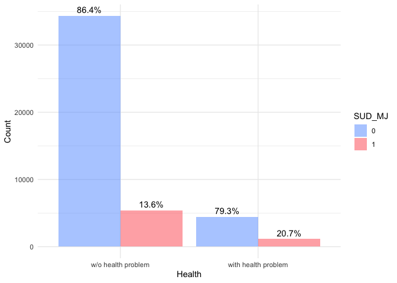
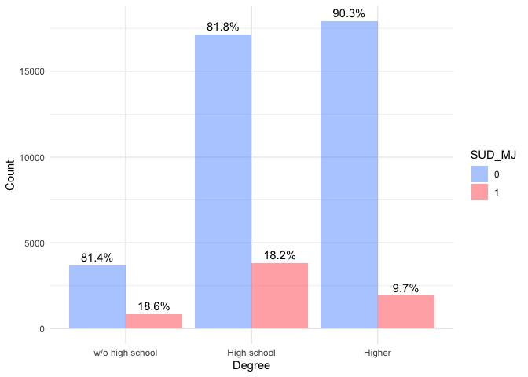
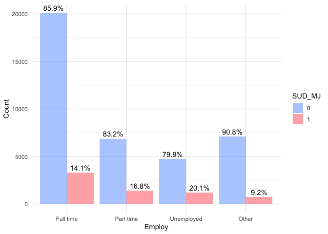

```r
# Load libraries
library(tidyverse)
library(dplyr)
library(readr)
library(ggplot2)
library(httr)
library(jsonlite)
library(foreach)
library(psych)
library(patchwork)
library(gt) # for better table output
library(gridExtra)
library(ROCR)
library(ranger)
library(randomForest)
#library(pak)
#pak::pak("caret")
library(caret)
library(e1071)
library(nnet)
library(dummy)
library(gbm)
library(glmnet)
```

# Introduction 

Marijuana has gained increasing prevalence in the US. As of April 2024, 38 states have legalized the medical use of marijuana products, and among these, 24 states have also legalized recreational marijuana (citation). The pros and cons of marijuana legalization remain an ongoing debate. Some studies suggest that the increasing popularity of marijuana products is associated with an increasing risk of developing marijuana use disorder (citation). In 2012-2013, among the 9.52% of US adults who used marijuana, 2.9% had a diagnosis of DSM-IV marijuana use disorder. In other words, nearly 3 out of every 10 marijuana users had a diagnosis of a marijuana use disorder (citation). A more recent study suggests that about 27% of lifetime cannabis users transition to marijuana use disorder based on the DSM-5 diagnosis criteria (citation). Given the prevalence of marijuana products and the high risk of developing marijuana use disorder, it is imperative to identify and predict the associated risk factors. 

Previous literature has employed machine learning frameworks to research substance use disorder. For example, in a study by Acion et al. (2017), researchers used several machine learning models, including logistic regression, Random Forest (RF), Artificial Neural Network (ANN), and Super Learning (SL), as prediction tools for the success of substance use disorder treatment.

The goal of this project is to investigate the socio-demographic factors potentially associated with the risk of a marijuana user developing substance use disorder using a machine learning approach. By leveraging advanced machine learning models, I aim to identify key predictors and improve our understanding of the factors contributing to marijuana use disorder. The methodology I used is based on Rajapaksha et al. (2020), in which the researchers employed LASSO, KNN, Random Forest, SVM, and Gradient Boosting to estimate the chance of developing SUD based on various demographic, behavioral, psychiatric, and cognitive risk factors. 

In this project, I will use logistic regression, Lasso logistic regression, Random Forest, and Gradient Boosting The overall performance of the machine learning models will be evaluated using the area under the receiver operating characteristic curve (AUC), overall accuracy (i.e., the proportion of overall correct classifications), sensitivity (i.e., the proportion of correct classifications among the SUD instances/true positives), and specificity (i.e., the proportion of correct classifications among the non-SUD instances/true negatives). By comparing these metrics, I aim to determine the most effective machine learning model for predicting the risk of developing marijuana use disorder. This project can inform prevention and intervention strategies, ultimately aiding in addressing the challenges posed by increased marijuana use.

# Data

The data utilized in this project comes from the 2022 National Survey on Drug Use and Health (NSDUH) Releases. This survey provides nationally representative data on tobacco, alcohol, and drug use; substance use disorders; mental health issues; and the receipt of substance use and mental health treatment among the civilian, non-institutionalized population aged 12 and older in the United States. Compared to the 2021 NSDUH data, the 2022 version updated questions related to substance use treatment and mental health treatment, vaping of nicotine and marijuana, different methods of marijuana use, and the use of illegally made fentanyl (IMF). Most importantly, the 2022 NSDUH data is less affected by the COVID-19 pandemic than the 2021 data, which was a significant consideration in our previous project. In-person data collection for the 2022 NSDUH was only restricted in January 2022, resulting in a higher proportion of in-person interviews in 2022 compared to 2021.


```r
# Load data -- NSDUH 2022
load("/Users/jiashuliu/Desktop/Projects/substance_use_disorder/data/NSDUH_2022.RData")
sud_2022 <- read_csv("/Users/jiashuliu/Desktop/Projects/substance_use_disorder/data/sud_2022.csv")
```

#### Outcome Variable 

The outcome variable SUD_MJ is based on the DSM-5 Diagnostic Criteria for diagnosing and classifying substance use disorders. I reviewed questions from the marijuana use disorder section of the 2022 NSDUH data and identified the most relevant questions corresponding to the DSM-5 criteria. An SUD_MJ value of 1 indicates that the respondent has some level of marijuana use disorder, while a value of 0 indicates the absence of such a disorder. 


```r
# If any of the "udmj" variables have a value of 1, we set SUD_MJ as 1, otherwise SUD_MJ is 0.
NSDUH_2022_full <- NSDUH_2022 %>%
  mutate(across(starts_with("udmj"), 
                ~if_else(. %in% c(1, 2), 
                         if_else(. == 1, 1, 0), 
                         NA))) %>% 
  select(-"udmjavwothr") %>% 
  mutate(SUD_MJ = rowSums(select(., starts_with("udmj")), na.rm = TRUE)>=1, 
         SUD_MJ = if_else(SUD_MJ, 1, 0))
```

#### Predictors

A previous study indicates that the prevalence of marijuana use disorder varies among different age groups, races, and between people with and without mental health problems (citation). In this project,  there are 14 selected predictors, including age, sex, race, health status, marital status, highest degree obtained, school attendance, employment status, number of people in the household, number of children under 18 in the household, number of elderly people over 65 in the household, health insurance status, family income level, and mental health status.

All the socio-demographic variables in the survey are provided as categorical variables with various levels. I followed the methodology used in the original survey data but reorganized some variables into more general levels to make the data easier to analyze and interpret. For example, the predictor age (AGE3 in the survey data) originally had 10 levels. I consolidated these into four levels: 1 represents adolescents under age 18, 2 represents young adults aged 18 to 29, 3 indicates middle-aged individuals aged 30 to 64, and 4 represents elderly individuals aged 65 and older. The final cleaned dataset 


```r
codebook = data.frame(Variable = c("Age", "Sex", "Race", "Health", "Marital", "Degree", "Now going to school or not?", "Employment", "Persons in Household", "Kids age<18 in Household", "Elderly age>65 in Household", "Health Insurance", "Income: family income", "Mentalhealth: combined score of K6 questions"), 
                      Meaning = c("1=Adolescent: 18-, 2=Young Adult: 18-29, 3=Middle Age: 30-64, 4=Elderly: 65+", "0=Female, 1=Male", "1=NonHisp White, 2=NonHisp Black/Afr Am, 3=NonHisp Native Am/AK Native, 4=NonHisp Native HI/Other Pac Isl, 5=NonHisp Asian, 6=NonHisp more than one race, 7=Hispanic", "0=w/o health problem: excellent/very good/good, 1=with health problem: fair/poor", "0=never been married/cannot married<=14, 1=married, 2=widowed/divorced/separated", "1=w/o high school, 2=high school degree, 3=associate's degree/college graduate or higher", "1/11 = now going to school,  0=No, other is NA", "1=employed full time, 2=employed part time, 3=unemployed, 4=Other(incl. not in labor force)", "range 1-5, 6=6 or more people in household", "0=No children under 18 , 1=One child under 18, 2=Two children under 18, 3=Three or more children under 18.", "0=No people 65 or older in household, 1 = One person 65 or older in household, 2 = Two or more people 65 or older in household", "0=w/o health insurance, 1=health insurance", "1=poverty:20000-, 2=middle:74999-, 3=wealth:75000+", "range = 0 - 24, na:Aged 12-17"))
codebook %>%
  gt() %>%
  tab_header(
    title = md("**Codebook**")
  ) %>%
  tab_style(
    style = cell_fill(color = "aliceblue"),
    locations = cells_body(
      rows = Variable %in% c("Age", "Race", "Marital", "Now going to school or not?", "Persons in Household", "Elderly age>65 in Household", "Income: family income"))
  ) %>%
  tab_style(
    style = cell_fill(color = "skyblue"),
    locations = cells_body(
      rows = !(Variable %in% c("Age", "Race", "Marital", "Now going to school or not?", "Persons in Household", "Elderly age>65 in Household", "Income: family income"))
    )
  ) %>%
  tab_options(
    table.font.size = px(13L)
  )
```

```{=html}
<div id="viyjzpbygm" style="padding-left:0px;padding-right:0px;padding-top:10px;padding-bottom:10px;overflow-x:auto;overflow-y:auto;width:auto;height:auto;">
<style>#viyjzpbygm table {
  font-family: system-ui, 'Segoe UI', Roboto, Helvetica, Arial, sans-serif, 'Apple Color Emoji', 'Segoe UI Emoji', 'Segoe UI Symbol', 'Noto Color Emoji';
  -webkit-font-smoothing: antialiased;
  -moz-osx-font-smoothing: grayscale;
}

#viyjzpbygm thead, #viyjzpbygm tbody, #viyjzpbygm tfoot, #viyjzpbygm tr, #viyjzpbygm td, #viyjzpbygm th {
  border-style: none;
}

#viyjzpbygm p {
  margin: 0;
  padding: 0;
}

#viyjzpbygm .gt_table {
  display: table;
  border-collapse: collapse;
  line-height: normal;
  margin-left: auto;
  margin-right: auto;
  color: #333333;
  font-size: 13px;
  font-weight: normal;
  font-style: normal;
  background-color: #FFFFFF;
  width: auto;
  border-top-style: solid;
  border-top-width: 2px;
  border-top-color: #A8A8A8;
  border-right-style: none;
  border-right-width: 2px;
  border-right-color: #D3D3D3;
  border-bottom-style: solid;
  border-bottom-width: 2px;
  border-bottom-color: #A8A8A8;
  border-left-style: none;
  border-left-width: 2px;
  border-left-color: #D3D3D3;
}

#viyjzpbygm .gt_caption {
  padding-top: 4px;
  padding-bottom: 4px;
}

#viyjzpbygm .gt_title {
  color: #333333;
  font-size: 125%;
  font-weight: initial;
  padding-top: 4px;
  padding-bottom: 4px;
  padding-left: 5px;
  padding-right: 5px;
  border-bottom-color: #FFFFFF;
  border-bottom-width: 0;
}

#viyjzpbygm .gt_subtitle {
  color: #333333;
  font-size: 85%;
  font-weight: initial;
  padding-top: 3px;
  padding-bottom: 5px;
  padding-left: 5px;
  padding-right: 5px;
  border-top-color: #FFFFFF;
  border-top-width: 0;
}

#viyjzpbygm .gt_heading {
  background-color: #FFFFFF;
  text-align: center;
  border-bottom-color: #FFFFFF;
  border-left-style: none;
  border-left-width: 1px;
  border-left-color: #D3D3D3;
  border-right-style: none;
  border-right-width: 1px;
  border-right-color: #D3D3D3;
}

#viyjzpbygm .gt_bottom_border {
  border-bottom-style: solid;
  border-bottom-width: 2px;
  border-bottom-color: #D3D3D3;
}

#viyjzpbygm .gt_col_headings {
  border-top-style: solid;
  border-top-width: 2px;
  border-top-color: #D3D3D3;
  border-bottom-style: solid;
  border-bottom-width: 2px;
  border-bottom-color: #D3D3D3;
  border-left-style: none;
  border-left-width: 1px;
  border-left-color: #D3D3D3;
  border-right-style: none;
  border-right-width: 1px;
  border-right-color: #D3D3D3;
}

#viyjzpbygm .gt_col_heading {
  color: #333333;
  background-color: #FFFFFF;
  font-size: 100%;
  font-weight: normal;
  text-transform: inherit;
  border-left-style: none;
  border-left-width: 1px;
  border-left-color: #D3D3D3;
  border-right-style: none;
  border-right-width: 1px;
  border-right-color: #D3D3D3;
  vertical-align: bottom;
  padding-top: 5px;
  padding-bottom: 6px;
  padding-left: 5px;
  padding-right: 5px;
  overflow-x: hidden;
}

#viyjzpbygm .gt_column_spanner_outer {
  color: #333333;
  background-color: #FFFFFF;
  font-size: 100%;
  font-weight: normal;
  text-transform: inherit;
  padding-top: 0;
  padding-bottom: 0;
  padding-left: 4px;
  padding-right: 4px;
}

#viyjzpbygm .gt_column_spanner_outer:first-child {
  padding-left: 0;
}

#viyjzpbygm .gt_column_spanner_outer:last-child {
  padding-right: 0;
}

#viyjzpbygm .gt_column_spanner {
  border-bottom-style: solid;
  border-bottom-width: 2px;
  border-bottom-color: #D3D3D3;
  vertical-align: bottom;
  padding-top: 5px;
  padding-bottom: 5px;
  overflow-x: hidden;
  display: inline-block;
  width: 100%;
}

#viyjzpbygm .gt_spanner_row {
  border-bottom-style: hidden;
}

#viyjzpbygm .gt_group_heading {
  padding-top: 8px;
  padding-bottom: 8px;
  padding-left: 5px;
  padding-right: 5px;
  color: #333333;
  background-color: #FFFFFF;
  font-size: 100%;
  font-weight: initial;
  text-transform: inherit;
  border-top-style: solid;
  border-top-width: 2px;
  border-top-color: #D3D3D3;
  border-bottom-style: solid;
  border-bottom-width: 2px;
  border-bottom-color: #D3D3D3;
  border-left-style: none;
  border-left-width: 1px;
  border-left-color: #D3D3D3;
  border-right-style: none;
  border-right-width: 1px;
  border-right-color: #D3D3D3;
  vertical-align: middle;
  text-align: left;
}

#viyjzpbygm .gt_empty_group_heading {
  padding: 0.5px;
  color: #333333;
  background-color: #FFFFFF;
  font-size: 100%;
  font-weight: initial;
  border-top-style: solid;
  border-top-width: 2px;
  border-top-color: #D3D3D3;
  border-bottom-style: solid;
  border-bottom-width: 2px;
  border-bottom-color: #D3D3D3;
  vertical-align: middle;
}

#viyjzpbygm .gt_from_md > :first-child {
  margin-top: 0;
}

#viyjzpbygm .gt_from_md > :last-child {
  margin-bottom: 0;
}

#viyjzpbygm .gt_row {
  padding-top: 8px;
  padding-bottom: 8px;
  padding-left: 5px;
  padding-right: 5px;
  margin: 10px;
  border-top-style: solid;
  border-top-width: 1px;
  border-top-color: #D3D3D3;
  border-left-style: none;
  border-left-width: 1px;
  border-left-color: #D3D3D3;
  border-right-style: none;
  border-right-width: 1px;
  border-right-color: #D3D3D3;
  vertical-align: middle;
  overflow-x: hidden;
}

#viyjzpbygm .gt_stub {
  color: #333333;
  background-color: #FFFFFF;
  font-size: 100%;
  font-weight: initial;
  text-transform: inherit;
  border-right-style: solid;
  border-right-width: 2px;
  border-right-color: #D3D3D3;
  padding-left: 5px;
  padding-right: 5px;
}

#viyjzpbygm .gt_stub_row_group {
  color: #333333;
  background-color: #FFFFFF;
  font-size: 100%;
  font-weight: initial;
  text-transform: inherit;
  border-right-style: solid;
  border-right-width: 2px;
  border-right-color: #D3D3D3;
  padding-left: 5px;
  padding-right: 5px;
  vertical-align: top;
}

#viyjzpbygm .gt_row_group_first td {
  border-top-width: 2px;
}

#viyjzpbygm .gt_row_group_first th {
  border-top-width: 2px;
}

#viyjzpbygm .gt_summary_row {
  color: #333333;
  background-color: #FFFFFF;
  text-transform: inherit;
  padding-top: 8px;
  padding-bottom: 8px;
  padding-left: 5px;
  padding-right: 5px;
}

#viyjzpbygm .gt_first_summary_row {
  border-top-style: solid;
  border-top-color: #D3D3D3;
}

#viyjzpbygm .gt_first_summary_row.thick {
  border-top-width: 2px;
}

#viyjzpbygm .gt_last_summary_row {
  padding-top: 8px;
  padding-bottom: 8px;
  padding-left: 5px;
  padding-right: 5px;
  border-bottom-style: solid;
  border-bottom-width: 2px;
  border-bottom-color: #D3D3D3;
}

#viyjzpbygm .gt_grand_summary_row {
  color: #333333;
  background-color: #FFFFFF;
  text-transform: inherit;
  padding-top: 8px;
  padding-bottom: 8px;
  padding-left: 5px;
  padding-right: 5px;
}

#viyjzpbygm .gt_first_grand_summary_row {
  padding-top: 8px;
  padding-bottom: 8px;
  padding-left: 5px;
  padding-right: 5px;
  border-top-style: double;
  border-top-width: 6px;
  border-top-color: #D3D3D3;
}

#viyjzpbygm .gt_last_grand_summary_row_top {
  padding-top: 8px;
  padding-bottom: 8px;
  padding-left: 5px;
  padding-right: 5px;
  border-bottom-style: double;
  border-bottom-width: 6px;
  border-bottom-color: #D3D3D3;
}

#viyjzpbygm .gt_striped {
  background-color: rgba(128, 128, 128, 0.05);
}

#viyjzpbygm .gt_table_body {
  border-top-style: solid;
  border-top-width: 2px;
  border-top-color: #D3D3D3;
  border-bottom-style: solid;
  border-bottom-width: 2px;
  border-bottom-color: #D3D3D3;
}

#viyjzpbygm .gt_footnotes {
  color: #333333;
  background-color: #FFFFFF;
  border-bottom-style: none;
  border-bottom-width: 2px;
  border-bottom-color: #D3D3D3;
  border-left-style: none;
  border-left-width: 2px;
  border-left-color: #D3D3D3;
  border-right-style: none;
  border-right-width: 2px;
  border-right-color: #D3D3D3;
}

#viyjzpbygm .gt_footnote {
  margin: 0px;
  font-size: 90%;
  padding-top: 4px;
  padding-bottom: 4px;
  padding-left: 5px;
  padding-right: 5px;
}

#viyjzpbygm .gt_sourcenotes {
  color: #333333;
  background-color: #FFFFFF;
  border-bottom-style: none;
  border-bottom-width: 2px;
  border-bottom-color: #D3D3D3;
  border-left-style: none;
  border-left-width: 2px;
  border-left-color: #D3D3D3;
  border-right-style: none;
  border-right-width: 2px;
  border-right-color: #D3D3D3;
}

#viyjzpbygm .gt_sourcenote {
  font-size: 90%;
  padding-top: 4px;
  padding-bottom: 4px;
  padding-left: 5px;
  padding-right: 5px;
}

#viyjzpbygm .gt_left {
  text-align: left;
}

#viyjzpbygm .gt_center {
  text-align: center;
}

#viyjzpbygm .gt_right {
  text-align: right;
  font-variant-numeric: tabular-nums;
}

#viyjzpbygm .gt_font_normal {
  font-weight: normal;
}

#viyjzpbygm .gt_font_bold {
  font-weight: bold;
}

#viyjzpbygm .gt_font_italic {
  font-style: italic;
}

#viyjzpbygm .gt_super {
  font-size: 65%;
}

#viyjzpbygm .gt_footnote_marks {
  font-size: 75%;
  vertical-align: 0.4em;
  position: initial;
}

#viyjzpbygm .gt_asterisk {
  font-size: 100%;
  vertical-align: 0;
}

#viyjzpbygm .gt_indent_1 {
  text-indent: 5px;
}

#viyjzpbygm .gt_indent_2 {
  text-indent: 10px;
}

#viyjzpbygm .gt_indent_3 {
  text-indent: 15px;
}

#viyjzpbygm .gt_indent_4 {
  text-indent: 20px;
}

#viyjzpbygm .gt_indent_5 {
  text-indent: 25px;
}
</style>
<table class="gt_table" data-quarto-disable-processing="false" data-quarto-bootstrap="false">
  <thead>
    <tr class="gt_heading">
      <td colspan="2" class="gt_heading gt_title gt_font_normal gt_bottom_border" style><strong>Codebook</strong></td>
    </tr>
    
    <tr class="gt_col_headings">
      <th class="gt_col_heading gt_columns_bottom_border gt_left" rowspan="1" colspan="1" scope="col" id="Variable">Variable</th>
      <th class="gt_col_heading gt_columns_bottom_border gt_left" rowspan="1" colspan="1" scope="col" id="Meaning">Meaning</th>
    </tr>
  </thead>
  <tbody class="gt_table_body">
    <tr><td headers="Variable" class="gt_row gt_left" style="background-color: #F0F8FF;">Age</td>
<td headers="Meaning" class="gt_row gt_left" style="background-color: #F0F8FF;">1=Adolescent: 18-, 2=Young Adult: 18-29, 3=Middle Age: 30-64, 4=Elderly: 65+</td></tr>
    <tr><td headers="Variable" class="gt_row gt_left" style="background-color: #87CEEB;">Sex</td>
<td headers="Meaning" class="gt_row gt_left" style="background-color: #87CEEB;">0=Female, 1=Male</td></tr>
    <tr><td headers="Variable" class="gt_row gt_left" style="background-color: #F0F8FF;">Race</td>
<td headers="Meaning" class="gt_row gt_left" style="background-color: #F0F8FF;">1=NonHisp White, 2=NonHisp Black/Afr Am, 3=NonHisp Native Am/AK Native, 4=NonHisp Native HI/Other Pac Isl, 5=NonHisp Asian, 6=NonHisp more than one race, 7=Hispanic</td></tr>
    <tr><td headers="Variable" class="gt_row gt_left" style="background-color: #87CEEB;">Health</td>
<td headers="Meaning" class="gt_row gt_left" style="background-color: #87CEEB;">0=w/o health problem: excellent/very good/good, 1=with health problem: fair/poor</td></tr>
    <tr><td headers="Variable" class="gt_row gt_left" style="background-color: #F0F8FF;">Marital</td>
<td headers="Meaning" class="gt_row gt_left" style="background-color: #F0F8FF;">0=never been married/cannot married&lt;=14, 1=married, 2=widowed/divorced/separated</td></tr>
    <tr><td headers="Variable" class="gt_row gt_left" style="background-color: #87CEEB;">Degree</td>
<td headers="Meaning" class="gt_row gt_left" style="background-color: #87CEEB;">1=w/o high school, 2=high school degree, 3=associate's degree/college graduate or higher</td></tr>
    <tr><td headers="Variable" class="gt_row gt_left" style="background-color: #F0F8FF;">Now going to school or not?</td>
<td headers="Meaning" class="gt_row gt_left" style="background-color: #F0F8FF;">1/11 = now going to school,  0=No, other is NA</td></tr>
    <tr><td headers="Variable" class="gt_row gt_left" style="background-color: #87CEEB;">Employment</td>
<td headers="Meaning" class="gt_row gt_left" style="background-color: #87CEEB;">1=employed full time, 2=employed part time, 3=unemployed, 4=Other(incl. not in labor force)</td></tr>
    <tr><td headers="Variable" class="gt_row gt_left" style="background-color: #F0F8FF;">Persons in Household</td>
<td headers="Meaning" class="gt_row gt_left" style="background-color: #F0F8FF;">range 1-5, 6=6 or more people in household</td></tr>
    <tr><td headers="Variable" class="gt_row gt_left" style="background-color: #87CEEB;">Kids age&lt;18 in Household</td>
<td headers="Meaning" class="gt_row gt_left" style="background-color: #87CEEB;">0=No children under 18 , 1=One child under 18, 2=Two children under 18, 3=Three or more children under 18.</td></tr>
    <tr><td headers="Variable" class="gt_row gt_left" style="background-color: #F0F8FF;">Elderly age&gt;65 in Household</td>
<td headers="Meaning" class="gt_row gt_left" style="background-color: #F0F8FF;">0=No people 65 or older in household, 1 = One person 65 or older in household, 2 = Two or more people 65 or older in household</td></tr>
    <tr><td headers="Variable" class="gt_row gt_left" style="background-color: #87CEEB;">Health Insurance</td>
<td headers="Meaning" class="gt_row gt_left" style="background-color: #87CEEB;">0=w/o health insurance, 1=health insurance</td></tr>
    <tr><td headers="Variable" class="gt_row gt_left" style="background-color: #F0F8FF;">Income: family income</td>
<td headers="Meaning" class="gt_row gt_left" style="background-color: #F0F8FF;">1=poverty:20000-, 2=middle:74999-, 3=wealth:75000+</td></tr>
    <tr><td headers="Variable" class="gt_row gt_left" style="background-color: #87CEEB;">Mentalhealth: combined score of K6 questions</td>
<td headers="Meaning" class="gt_row gt_left" style="background-color: #87CEEB;">range = 0 - 24, na:Aged 12-17</td></tr>
  </tbody>
  
  
</table>
</div>
```


```r
# Predictors -- Demographics
# 1) age (1=Adolescent: 18-, 2=Young Adult: 18-29, 3=Middle Age: 30-64, 4=Elderly: 65+)
NSDUH_2022_full <- NSDUH_2022_full %>% 
  mutate(age = case_when(AGE3 %in% c(1:3) ~ 1,
                         AGE3 %in% c(4:8) ~ 2,
                         AGE3 %in% c(9:10) ~ 3,
                         TRUE ~ 4))
# 2) sex (0=Female, 1=Male)
NSDUH_2022_full <- NSDUH_2022_full %>% 
  mutate(sex = if_else(irsex == 2,0,1))

# 3) race (1=NonHisp White, 2=NonHisp Black/Afr Am, 3=NonHisp Native Am/AK Native, 4=NonHisp Native HI/Other Pac Isl, 5=NonHisp Asian, 6=NonHisp more than one race, 7=Hispanic)
NSDUH_2022_full <- NSDUH_2022_full %>% 
  mutate(race = NEWRACE2)
  #mutate(race = case_when(NEWRACE2 %in% c(2:6) ~ 2,
                         # NEWRACE2 == 7 ~ 3,
                          #TRUE ~ 1))

# 4) health (0=w/o health problem: excellent/very good/good, 1=with health problem: fair/poor)
NSDUH_2022_full <- NSDUH_2022_full %>% 
  mutate(health = case_when(health %in% c(1:3) ~ 0,
                            health %in% c(4:5) ~ 1,
                            TRUE ~ NA))

# 5) marital (0=never been married/cannot married<=14, 1=married, 2=widowed/divorced/separated)
NSDUH_2022_full <- NSDUH_2022_full %>% 
  mutate(marital = case_when(irmarit %in% c(4,99) ~ 0,
                             irmarit %in% c(2:3) ~ 2,
                             TRUE ~ 1))

# Predictors -- Education
# 6) degree (1=w/o high school, 2=high school degree, 3=associate's degree/college graduate or higher)
NSDUH_2022_full <- NSDUH_2022_full %>% 
  mutate(degree = case_when(IREDUHIGHST2 %in% c(1:7) ~ 1,
                            IREDUHIGHST2 %in% c(8:9) ~ 2,
                            TRUE ~ 3))

# 7) Now going to school or not? (1/11 = now going to school,  0=No, other is NA)
NSDUH_2022_full <- NSDUH_2022_full %>% 
  mutate(student = case_when(eduschlgo %in% c(1, 11) ~ 1,
                             eduschlgo == 2 ~ 0,
                             TRUE ~ NA))

# Predictors: Employment and Houshold Composition
# 8) employ (1=employed full time, 2=employed part time, 3=unemployed, 4=Other(incl. not in labor force))
NSDUH_2022_full <- NSDUH_2022_full %>% 
  mutate(employ = case_when(WRKSTATWK2 %in% c(1,6) ~ 1,
                            WRKSTATWK2 %in% c(2:3) ~ 2,
                            WRKSTATWK2 %in% c(4,9) ~ 3,
                            TRUE ~ 4))

# 9) persons in household (range 1-5, 6=6 or more people in household)
NSDUH_2022_full <- NSDUH_2022_full %>% mutate(family = IRHHSIZ2)

# 10) kids age<18 in Household
# 0 = No children under 18 
# 1 = One child under 18
# 2 = Two children under 18 
# 3 = Three or more children under 18.
NSDUH_2022_full <- NSDUH_2022_full %>% mutate(kid = IRKI17_2 - 1)

# 11) elderly age>65 in Household (range 0-1, 2=2 or more elders in household)
# 0 = No people 65 or older in household
# 1 = One person 65 or older in household
# 2 = Two or more people 65 or older in household
NSDUH_2022_full <- NSDUH_2022_full %>% mutate(elderly = IRHH65_2-1)

# Predictors: Health and Income 
# 12) health_insur (0=w/o health insurance, 1=health insurance)
NSDUH_2022_full <- NSDUH_2022_full %>% 
  mutate(health_insur = case_when(
    irmedicr == 1 | irmcdchp == 1 | irchmpus == 1 | irprvhlt == 1 ~ 1,
    irothhlt == 1 ~ 1,
    irothhlt == 2 ~ 0,
    irothhlt == 99 ~ NA,
    TRUE ~ 0
  ))

# 13) income: family income (1=poverty:20000-, 2=middle:74999-, 3=wealth:75000+)
NSDUH_2022_full <- NSDUH_2022_full %>% 
  mutate(income = case_when(IRFAMIN3 %in% c(1:2) ~ 1,
                            IRFAMIN3 %in% c(3:6) ~ 2,
                            TRUE ~ 3))

# 14) mentalhealth: combined score of K6 questions (range = 0 - 24, na:Aged 12-17) 
NSDUH_2022_full <- NSDUH_2022_full %>% 
  mutate(k1 = case_when(IRDSTCHR30 == 1 ~ 4,
                         IRDSTCHR30 == 2 ~ 3,
                         IRDSTCHR30 == 3 ~ 2,
                         IRDSTCHR30 == 4 ~ 1,
                         IRDSTCHR30 == 5 ~ 0,
                         TRUE ~ 99),
         k2 = case_when(IRDSTEFF30 == 1 ~ 4,
                         IRDSTEFF30 == 2 ~ 3,
                         IRDSTEFF30 == 3 ~ 2,
                         IRDSTEFF30 == 4 ~ 1,
                         IRDSTEFF30 == 5 ~ 0,
                         TRUE ~ 99),
         k3 = case_when(IRDSTHOP30 == 1 ~ 4,
                         IRDSTHOP30 == 2 ~ 3,
                         IRDSTHOP30 == 3 ~ 2,
                         IRDSTHOP30 == 4 ~ 1,
                         IRDSTHOP30 == 5 ~ 0,
                         TRUE ~ 99),
         k4 = case_when(IRDSTNGD30 == 1 ~ 4,
                         IRDSTNGD30 == 2 ~ 3,
                         IRDSTNGD30 == 3 ~ 2,
                         IRDSTNGD30 == 4 ~ 1,
                         IRDSTNGD30 == 5 ~ 0,
                         TRUE ~ 99),
         k5 = case_when(IRDSTNRV30 == 1 ~ 4,
                         IRDSTNRV30 == 2 ~ 3,
                         IRDSTNRV30 == 3 ~ 2,
                         IRDSTNRV30 == 4 ~ 1,
                         IRDSTNRV30 == 5 ~ 0,
                         TRUE ~ 99),
         k6 = case_when(IRDSTRST30 == 1 ~ 4,
                         IRDSTRST30 == 2 ~ 3,
                         IRDSTRST30 == 3 ~ 2,
                         IRDSTRST30 == 4 ~ 1,
                         IRDSTRST30 == 5 ~ 0,
                         TRUE ~ 99),
         mentalhealth = case_when(k1 == 99 | k2 == 99 | k3 == 99 | k4 == 99 | 
                                    k5 == 99 | k6 == 99 ~  NA,
                                  TRUE ~ k1+k2+k3+k4+k5+k6))
# For each of the six items listed above, responses of "all of the time" were coded 4, 
#"most of the time" were coded 3, "some of the time" were coded 2, "a little of the time" 
#were coded 1, and "none of the time" were coded 0. These assigned values were summed 
#across the six items to calculate a total score for mentalhealth.

# Create new dataset and drop all the NA values
data_cleaned <- NSDUH_2022_full %>%
  select(age, sex, race, health, marital, degree, 
         student, employ, family, kid, elderly, health_insur, 
         income, mentalhealth, SUD_MJ) %>%
  drop_na()
# check NAs
# anyNA(data_cleaned)
# New csv file
# write_csv(data_cleaned,"/Users/jiashuliu/Desktop/Projects/substance_use_disorder/data/sud_2022.csv")
```

# Exploratory Data Analysis

### Data Visualization

**Age**:
The age variable is categorized into four levels: "Adolescent" (under 18), "Young Adult" (18 to 29), "Middle Age" (30 to 64), and "Elderly" (65 and older). The plot shows the percentage of individuals within each age group who either have (SUD_MJ = 1) or do not have (SUD_MJ = 0) marijuana use disorder.

Among young adults (18 to 29 years), 20.6% of the respondents have marijuana use disorder, and 79.4% do not. In the middle-age group (30 to 64 years), 9.9% of respondents have marijuana use disorder, while 90.1% do not. In the elderly group (65+ years), only 2.5% of the respondents have marijuana use disorder, and 97.5% do not. The filtered survey data reveals that, at least in 2022, no adolescents are reported to have marijuana use disorder. The young adult group has the highest percentage of respondents with marijuana use disorder among the three age groups.


```r
# age (1=Adolescent: 18-, 2=Young Adult: 18-29, 3=Middle Age: 30-64, 4=Elderly: 65+)

# Calculate the percentage of SUD_MJ for each sex and each level of SUD_MJ
percentage_age <- sud_2022 %>%
  group_by(age, SUD_MJ) %>%
  summarize(count = n()) %>%
  mutate(percentage = count / sum(count) * 100)

percentage_age <- percentage_age %>%
  mutate(age = factor(age, levels = c(1, 2, 3, 4), labels = c("Adolescent", "Young Adult", "Middle Age","Elderly")),
         SUD_MJ = factor(SUD_MJ, levels = c(0, 1), labels = c("0", "1")))

p1.1 <- sud_2022 %>% 
  ggplot(aes(x = factor(age, levels = 1:4, labels = c("Adolescent", "Young Adult", "Middle Age","Elderly")), fill = factor(SUD_MJ))) +
  geom_bar(alpha = 0.5, position = "dodge") +
  scale_fill_manual(values = c("#619CFF", "#FF595E"),name = "SUD_MJ") +
  labs(x = "age", y = "Count") +
  theme_minimal()+
  geom_text(data = percentage_age, aes(x = age, y = count, label = paste0(round(percentage, 1), "%")),
            position = position_dodge(width = 0.9), vjust = -0.5)
p1.1
```

<!-- -->

**Sex**:
The sex variable is categorized into two groups -- Female and Male. The plot shows the percentage of individuals within each sex group who either have (SUD_MJ = 1) or do not have (SUD_MJ = 0) marijuana use disorder. From the bar plot, we can see that the percentage of males with a marijuana use disorder in 2022 is slightly higher than that of females, with 17% of males having a marijuana use disorder and 12.5% of females having a marijuana use disorder.


```r
# Calculate the percentage of SUD_MJ for each sex and each level of SUD_MJ
percentage <- sud_2022 %>%
  group_by(sex, SUD_MJ) %>%
  summarize(count = n()) %>%
  mutate(percentage = count / sum(count) * 100)

percentage <- percentage %>%
  mutate(sex = factor(sex, levels = c(0, 1), labels = c("Female", "Male")),
         SUD_MJ = factor(SUD_MJ, levels = c(0, 1), labels = c("0", "1")))

# Plot SUD_MJ percentages in each gender group
p2 <- sud_2022 %>%
  ggplot(aes(x = factor(sex, levels = c(0, 1), labels = c("Female", "Male")), fill = factor(SUD_MJ))) +
  geom_bar(alpha = 0.5, position = "dodge") +
  scale_fill_manual(values = c("#619CFF", "#FF595E"), name = "SUD_MJ") +
  labs(x = "Sex", y = "Count") +
  theme_minimal() +
  geom_text(data = percentage, aes(x = sex, y = count, label = paste0(round(percentage, 1), "%")),
            position = position_dodge(width = 0.9), vjust = -0.5)

p2
```

<!-- -->

**Race**:
The following table summarizes the distribution of marijuana use disorder (SUD_MJ) among different racial groups. The count and percentage are provided for each combination of race and SUD_MJ status. The "NonHisp Asian" group has the lowest percentage (5.2%) of individuals with SUD_MJ, while the "NonHisp Native Am/AK Native" group has the highest percentage (27.3%). The "NonHisp White" group has the second-lowest percentage (13.7%) of individuals with SUD_MJ, and the "NonHisp More Than One Race" group has the second-highest percentage (23.1%). The "NonHisp Black/Afr Am" group has a percentage of 17.9% of individuals with SUD_MJ, which is higher than the "Hispanic" group, which has 15.1% of individuals with SUD_MJ.


```r
race_dat <- sud_2022 %>%
  mutate(race = factor(race, levels = 1:7, labels = c("NonHisp White", "NonHisp Black/Afr Am", "NonHisp Native Am/AK Native", "NonHisp Native HI/Other Pac Isl", "NonHisp Asian", "NonHisp more than one race", "Hispanic")))
race_summary <- race_dat %>%
  group_by(race, SUD_MJ) %>%
  summarize(count = n(), .groups = 'drop') %>%
  group_by(race) %>%
  mutate(percentage = round(count / sum(count) * 100, 1)) %>%
  ungroup()
highlighted_table <- race_summary %>%
  gt() %>%
  tab_style(
    style = cell_fill(color = "lightyellow"),
    locations = cells_body(
      rows = race == "NonHisp Native Am/AK Native" & SUD_MJ == 1
    )
  ) %>% 
  tab_style(
    style = cell_fill(color = "honeydew"),
    locations = cells_body(
      rows = race == "NonHisp Asian" & SUD_MJ == 1
    )
  )
highlighted_table
```

```{=html}
<div id="kkvchtxddf" style="padding-left:0px;padding-right:0px;padding-top:10px;padding-bottom:10px;overflow-x:auto;overflow-y:auto;width:auto;height:auto;">
<style>#kkvchtxddf table {
  font-family: system-ui, 'Segoe UI', Roboto, Helvetica, Arial, sans-serif, 'Apple Color Emoji', 'Segoe UI Emoji', 'Segoe UI Symbol', 'Noto Color Emoji';
  -webkit-font-smoothing: antialiased;
  -moz-osx-font-smoothing: grayscale;
}

#kkvchtxddf thead, #kkvchtxddf tbody, #kkvchtxddf tfoot, #kkvchtxddf tr, #kkvchtxddf td, #kkvchtxddf th {
  border-style: none;
}

#kkvchtxddf p {
  margin: 0;
  padding: 0;
}

#kkvchtxddf .gt_table {
  display: table;
  border-collapse: collapse;
  line-height: normal;
  margin-left: auto;
  margin-right: auto;
  color: #333333;
  font-size: 16px;
  font-weight: normal;
  font-style: normal;
  background-color: #FFFFFF;
  width: auto;
  border-top-style: solid;
  border-top-width: 2px;
  border-top-color: #A8A8A8;
  border-right-style: none;
  border-right-width: 2px;
  border-right-color: #D3D3D3;
  border-bottom-style: solid;
  border-bottom-width: 2px;
  border-bottom-color: #A8A8A8;
  border-left-style: none;
  border-left-width: 2px;
  border-left-color: #D3D3D3;
}

#kkvchtxddf .gt_caption {
  padding-top: 4px;
  padding-bottom: 4px;
}

#kkvchtxddf .gt_title {
  color: #333333;
  font-size: 125%;
  font-weight: initial;
  padding-top: 4px;
  padding-bottom: 4px;
  padding-left: 5px;
  padding-right: 5px;
  border-bottom-color: #FFFFFF;
  border-bottom-width: 0;
}

#kkvchtxddf .gt_subtitle {
  color: #333333;
  font-size: 85%;
  font-weight: initial;
  padding-top: 3px;
  padding-bottom: 5px;
  padding-left: 5px;
  padding-right: 5px;
  border-top-color: #FFFFFF;
  border-top-width: 0;
}

#kkvchtxddf .gt_heading {
  background-color: #FFFFFF;
  text-align: center;
  border-bottom-color: #FFFFFF;
  border-left-style: none;
  border-left-width: 1px;
  border-left-color: #D3D3D3;
  border-right-style: none;
  border-right-width: 1px;
  border-right-color: #D3D3D3;
}

#kkvchtxddf .gt_bottom_border {
  border-bottom-style: solid;
  border-bottom-width: 2px;
  border-bottom-color: #D3D3D3;
}

#kkvchtxddf .gt_col_headings {
  border-top-style: solid;
  border-top-width: 2px;
  border-top-color: #D3D3D3;
  border-bottom-style: solid;
  border-bottom-width: 2px;
  border-bottom-color: #D3D3D3;
  border-left-style: none;
  border-left-width: 1px;
  border-left-color: #D3D3D3;
  border-right-style: none;
  border-right-width: 1px;
  border-right-color: #D3D3D3;
}

#kkvchtxddf .gt_col_heading {
  color: #333333;
  background-color: #FFFFFF;
  font-size: 100%;
  font-weight: normal;
  text-transform: inherit;
  border-left-style: none;
  border-left-width: 1px;
  border-left-color: #D3D3D3;
  border-right-style: none;
  border-right-width: 1px;
  border-right-color: #D3D3D3;
  vertical-align: bottom;
  padding-top: 5px;
  padding-bottom: 6px;
  padding-left: 5px;
  padding-right: 5px;
  overflow-x: hidden;
}

#kkvchtxddf .gt_column_spanner_outer {
  color: #333333;
  background-color: #FFFFFF;
  font-size: 100%;
  font-weight: normal;
  text-transform: inherit;
  padding-top: 0;
  padding-bottom: 0;
  padding-left: 4px;
  padding-right: 4px;
}

#kkvchtxddf .gt_column_spanner_outer:first-child {
  padding-left: 0;
}

#kkvchtxddf .gt_column_spanner_outer:last-child {
  padding-right: 0;
}

#kkvchtxddf .gt_column_spanner {
  border-bottom-style: solid;
  border-bottom-width: 2px;
  border-bottom-color: #D3D3D3;
  vertical-align: bottom;
  padding-top: 5px;
  padding-bottom: 5px;
  overflow-x: hidden;
  display: inline-block;
  width: 100%;
}

#kkvchtxddf .gt_spanner_row {
  border-bottom-style: hidden;
}

#kkvchtxddf .gt_group_heading {
  padding-top: 8px;
  padding-bottom: 8px;
  padding-left: 5px;
  padding-right: 5px;
  color: #333333;
  background-color: #FFFFFF;
  font-size: 100%;
  font-weight: initial;
  text-transform: inherit;
  border-top-style: solid;
  border-top-width: 2px;
  border-top-color: #D3D3D3;
  border-bottom-style: solid;
  border-bottom-width: 2px;
  border-bottom-color: #D3D3D3;
  border-left-style: none;
  border-left-width: 1px;
  border-left-color: #D3D3D3;
  border-right-style: none;
  border-right-width: 1px;
  border-right-color: #D3D3D3;
  vertical-align: middle;
  text-align: left;
}

#kkvchtxddf .gt_empty_group_heading {
  padding: 0.5px;
  color: #333333;
  background-color: #FFFFFF;
  font-size: 100%;
  font-weight: initial;
  border-top-style: solid;
  border-top-width: 2px;
  border-top-color: #D3D3D3;
  border-bottom-style: solid;
  border-bottom-width: 2px;
  border-bottom-color: #D3D3D3;
  vertical-align: middle;
}

#kkvchtxddf .gt_from_md > :first-child {
  margin-top: 0;
}

#kkvchtxddf .gt_from_md > :last-child {
  margin-bottom: 0;
}

#kkvchtxddf .gt_row {
  padding-top: 8px;
  padding-bottom: 8px;
  padding-left: 5px;
  padding-right: 5px;
  margin: 10px;
  border-top-style: solid;
  border-top-width: 1px;
  border-top-color: #D3D3D3;
  border-left-style: none;
  border-left-width: 1px;
  border-left-color: #D3D3D3;
  border-right-style: none;
  border-right-width: 1px;
  border-right-color: #D3D3D3;
  vertical-align: middle;
  overflow-x: hidden;
}

#kkvchtxddf .gt_stub {
  color: #333333;
  background-color: #FFFFFF;
  font-size: 100%;
  font-weight: initial;
  text-transform: inherit;
  border-right-style: solid;
  border-right-width: 2px;
  border-right-color: #D3D3D3;
  padding-left: 5px;
  padding-right: 5px;
}

#kkvchtxddf .gt_stub_row_group {
  color: #333333;
  background-color: #FFFFFF;
  font-size: 100%;
  font-weight: initial;
  text-transform: inherit;
  border-right-style: solid;
  border-right-width: 2px;
  border-right-color: #D3D3D3;
  padding-left: 5px;
  padding-right: 5px;
  vertical-align: top;
}

#kkvchtxddf .gt_row_group_first td {
  border-top-width: 2px;
}

#kkvchtxddf .gt_row_group_first th {
  border-top-width: 2px;
}

#kkvchtxddf .gt_summary_row {
  color: #333333;
  background-color: #FFFFFF;
  text-transform: inherit;
  padding-top: 8px;
  padding-bottom: 8px;
  padding-left: 5px;
  padding-right: 5px;
}

#kkvchtxddf .gt_first_summary_row {
  border-top-style: solid;
  border-top-color: #D3D3D3;
}

#kkvchtxddf .gt_first_summary_row.thick {
  border-top-width: 2px;
}

#kkvchtxddf .gt_last_summary_row {
  padding-top: 8px;
  padding-bottom: 8px;
  padding-left: 5px;
  padding-right: 5px;
  border-bottom-style: solid;
  border-bottom-width: 2px;
  border-bottom-color: #D3D3D3;
}

#kkvchtxddf .gt_grand_summary_row {
  color: #333333;
  background-color: #FFFFFF;
  text-transform: inherit;
  padding-top: 8px;
  padding-bottom: 8px;
  padding-left: 5px;
  padding-right: 5px;
}

#kkvchtxddf .gt_first_grand_summary_row {
  padding-top: 8px;
  padding-bottom: 8px;
  padding-left: 5px;
  padding-right: 5px;
  border-top-style: double;
  border-top-width: 6px;
  border-top-color: #D3D3D3;
}

#kkvchtxddf .gt_last_grand_summary_row_top {
  padding-top: 8px;
  padding-bottom: 8px;
  padding-left: 5px;
  padding-right: 5px;
  border-bottom-style: double;
  border-bottom-width: 6px;
  border-bottom-color: #D3D3D3;
}

#kkvchtxddf .gt_striped {
  background-color: rgba(128, 128, 128, 0.05);
}

#kkvchtxddf .gt_table_body {
  border-top-style: solid;
  border-top-width: 2px;
  border-top-color: #D3D3D3;
  border-bottom-style: solid;
  border-bottom-width: 2px;
  border-bottom-color: #D3D3D3;
}

#kkvchtxddf .gt_footnotes {
  color: #333333;
  background-color: #FFFFFF;
  border-bottom-style: none;
  border-bottom-width: 2px;
  border-bottom-color: #D3D3D3;
  border-left-style: none;
  border-left-width: 2px;
  border-left-color: #D3D3D3;
  border-right-style: none;
  border-right-width: 2px;
  border-right-color: #D3D3D3;
}

#kkvchtxddf .gt_footnote {
  margin: 0px;
  font-size: 90%;
  padding-top: 4px;
  padding-bottom: 4px;
  padding-left: 5px;
  padding-right: 5px;
}

#kkvchtxddf .gt_sourcenotes {
  color: #333333;
  background-color: #FFFFFF;
  border-bottom-style: none;
  border-bottom-width: 2px;
  border-bottom-color: #D3D3D3;
  border-left-style: none;
  border-left-width: 2px;
  border-left-color: #D3D3D3;
  border-right-style: none;
  border-right-width: 2px;
  border-right-color: #D3D3D3;
}

#kkvchtxddf .gt_sourcenote {
  font-size: 90%;
  padding-top: 4px;
  padding-bottom: 4px;
  padding-left: 5px;
  padding-right: 5px;
}

#kkvchtxddf .gt_left {
  text-align: left;
}

#kkvchtxddf .gt_center {
  text-align: center;
}

#kkvchtxddf .gt_right {
  text-align: right;
  font-variant-numeric: tabular-nums;
}

#kkvchtxddf .gt_font_normal {
  font-weight: normal;
}

#kkvchtxddf .gt_font_bold {
  font-weight: bold;
}

#kkvchtxddf .gt_font_italic {
  font-style: italic;
}

#kkvchtxddf .gt_super {
  font-size: 65%;
}

#kkvchtxddf .gt_footnote_marks {
  font-size: 75%;
  vertical-align: 0.4em;
  position: initial;
}

#kkvchtxddf .gt_asterisk {
  font-size: 100%;
  vertical-align: 0;
}

#kkvchtxddf .gt_indent_1 {
  text-indent: 5px;
}

#kkvchtxddf .gt_indent_2 {
  text-indent: 10px;
}

#kkvchtxddf .gt_indent_3 {
  text-indent: 15px;
}

#kkvchtxddf .gt_indent_4 {
  text-indent: 20px;
}

#kkvchtxddf .gt_indent_5 {
  text-indent: 25px;
}
</style>
<table class="gt_table" data-quarto-disable-processing="false" data-quarto-bootstrap="false">
  <thead>
    <tr class="gt_col_headings">
      <th class="gt_col_heading gt_columns_bottom_border gt_center" rowspan="1" colspan="1" scope="col" id="race">race</th>
      <th class="gt_col_heading gt_columns_bottom_border gt_right" rowspan="1" colspan="1" scope="col" id="SUD_MJ">SUD_MJ</th>
      <th class="gt_col_heading gt_columns_bottom_border gt_right" rowspan="1" colspan="1" scope="col" id="count">count</th>
      <th class="gt_col_heading gt_columns_bottom_border gt_right" rowspan="1" colspan="1" scope="col" id="percentage">percentage</th>
    </tr>
  </thead>
  <tbody class="gt_table_body">
    <tr><td headers="race" class="gt_row gt_center">NonHisp White</td>
<td headers="SUD_MJ" class="gt_row gt_right">0</td>
<td headers="count" class="gt_row gt_right">23718</td>
<td headers="percentage" class="gt_row gt_right">86.3</td></tr>
    <tr><td headers="race" class="gt_row gt_center">NonHisp White</td>
<td headers="SUD_MJ" class="gt_row gt_right">1</td>
<td headers="count" class="gt_row gt_right">3772</td>
<td headers="percentage" class="gt_row gt_right">13.7</td></tr>
    <tr><td headers="race" class="gt_row gt_center">NonHisp Black/Afr Am</td>
<td headers="SUD_MJ" class="gt_row gt_right">0</td>
<td headers="count" class="gt_row gt_right">4252</td>
<td headers="percentage" class="gt_row gt_right">82.1</td></tr>
    <tr><td headers="race" class="gt_row gt_center">NonHisp Black/Afr Am</td>
<td headers="SUD_MJ" class="gt_row gt_right">1</td>
<td headers="count" class="gt_row gt_right">927</td>
<td headers="percentage" class="gt_row gt_right">17.9</td></tr>
    <tr><td headers="race" class="gt_row gt_center">NonHisp Native Am/AK Native</td>
<td headers="SUD_MJ" class="gt_row gt_right">0</td>
<td headers="count" class="gt_row gt_right">437</td>
<td headers="percentage" class="gt_row gt_right">72.7</td></tr>
    <tr><td headers="race" class="gt_row gt_center" style="background-color: #FFFFE0;">NonHisp Native Am/AK Native</td>
<td headers="SUD_MJ" class="gt_row gt_right" style="background-color: #FFFFE0;">1</td>
<td headers="count" class="gt_row gt_right" style="background-color: #FFFFE0;">164</td>
<td headers="percentage" class="gt_row gt_right" style="background-color: #FFFFE0;">27.3</td></tr>
    <tr><td headers="race" class="gt_row gt_center">NonHisp Native HI/Other Pac Isl</td>
<td headers="SUD_MJ" class="gt_row gt_right">0</td>
<td headers="count" class="gt_row gt_right">165</td>
<td headers="percentage" class="gt_row gt_right">84.6</td></tr>
    <tr><td headers="race" class="gt_row gt_center">NonHisp Native HI/Other Pac Isl</td>
<td headers="SUD_MJ" class="gt_row gt_right">1</td>
<td headers="count" class="gt_row gt_right">30</td>
<td headers="percentage" class="gt_row gt_right">15.4</td></tr>
    <tr><td headers="race" class="gt_row gt_center">NonHisp Asian</td>
<td headers="SUD_MJ" class="gt_row gt_right">0</td>
<td headers="count" class="gt_row gt_right">2301</td>
<td headers="percentage" class="gt_row gt_right">94.8</td></tr>
    <tr><td headers="race" class="gt_row gt_center" style="background-color: #F0FFF0;">NonHisp Asian</td>
<td headers="SUD_MJ" class="gt_row gt_right" style="background-color: #F0FFF0;">1</td>
<td headers="count" class="gt_row gt_right" style="background-color: #F0FFF0;">127</td>
<td headers="percentage" class="gt_row gt_right" style="background-color: #F0FFF0;">5.2</td></tr>
    <tr><td headers="race" class="gt_row gt_center">NonHisp more than one race</td>
<td headers="SUD_MJ" class="gt_row gt_right">0</td>
<td headers="count" class="gt_row gt_right">1297</td>
<td headers="percentage" class="gt_row gt_right">76.9</td></tr>
    <tr><td headers="race" class="gt_row gt_center">NonHisp more than one race</td>
<td headers="SUD_MJ" class="gt_row gt_right">1</td>
<td headers="count" class="gt_row gt_right">390</td>
<td headers="percentage" class="gt_row gt_right">23.1</td></tr>
    <tr><td headers="race" class="gt_row gt_center">Hispanic</td>
<td headers="SUD_MJ" class="gt_row gt_right">0</td>
<td headers="count" class="gt_row gt_right">6584</td>
<td headers="percentage" class="gt_row gt_right">84.9</td></tr>
    <tr><td headers="race" class="gt_row gt_center">Hispanic</td>
<td headers="SUD_MJ" class="gt_row gt_right">1</td>
<td headers="count" class="gt_row gt_right">1167</td>
<td headers="percentage" class="gt_row gt_right">15.1</td></tr>
  </tbody>
  
  
</table>
</div>
```

**Health**:
The health variable is categorized into two groups: with and without health problems. The bar plot shows that individuals with health problems have a higher percentage (20.7%) of SUD_MJ compared to those without health problems (13.6%). Please note that the survey data did not specify the specific health problems for individuals who rate their health as fair/poor, and we are not inferring any causal relationship between any potential health problem and marijuana use disorder here. 


```r
# health (0=w/o health problem: excellent/very good/good, 1=with health problem: fair/poor)
health_percentage <- sud_2022 %>%
  group_by(health, SUD_MJ) %>%
  summarize(count = n()) %>%
  mutate(percentage = count / sum(count) * 100)

health_percentage <- health_percentage %>%
  mutate(health = factor(health, levels = c(0, 1), labels = c("w/o health problem", "with health problem")),
         SUD_MJ = factor(SUD_MJ, levels = c(0, 1), labels = c("0", "1")))
p3 <- sud_2022 %>% ggplot(
  aes(x = factor(health, levels = 0:1, labels = c("w/o health problem", "with health problem")),
      fill = factor(SUD_MJ))) +
  geom_bar(alpha = 0.5, position = "dodge") +
  scale_fill_manual(values = c("#619CFF", "#FF595E"),name = "SUD_MJ") +
  labs(x = "Health", y = "Count") +
  theme_minimal()+
  geom_text(data = health_percentage, aes(x = health, y = count, label = paste0(round(percentage, 1), "%")),
            position = position_dodge(width = 0.9), vjust = -0.5)
p3
```

<!-- -->

**Marital**:
The variable "Marital" is categorized into three groups: "Never married," "Married," and "Widowed/Divorced." The percentages of individuals with and without SUD_MJ are displayed on the bars within each group.

- Among those who have never married, 21.9% have a marijuana use disorder, while 78.1% do not. 
- For married individuals, 7.2% have a marijuana use disorder, while a substantial 92.8% do not. 
- In the widowed/divorced group, 11.6% have a marijuana use disorder, whereas 88.4% do not. 

The plot highlights that the highest percentage of marijuana use disorder is found among those who have never married, followed by the widowed/divorced group. Married individuals have the lowest percentage of marijuana use disorder.


```r
# marital (0=never been married/cannot married<=14, 1=married, 2=widowed/divorced/separated)
marital_percentage <- sud_2022 %>%
  group_by(marital, SUD_MJ) %>%
  summarize(count = n()) %>%
  mutate(percentage = count / sum(count) * 100)
marital_percentage <- marital_percentage %>%
  mutate(marital = factor(marital, levels = c(0, 1, 2), labels = c("Never married", "Married", "Widowed/Divorced")),
         SUD_MJ = factor(SUD_MJ, levels = c(0, 1), labels = c("0", "1")))
p4 <- sud_2022 %>% ggplot(
  aes(x = factor(marital, levels = 0:2, labels = c("Never married", "Married", 
                                                   "Widowed/Divorced")), fill = factor(SUD_MJ))) +
  geom_bar(alpha = 0.5, position = "dodge") +
  scale_fill_manual(values = c("#619CFF", "#FF595E"),name = "SUD_MJ") +
  labs(x = "Marital", y = "Count") +
  theme_minimal() + 
  geom_text(data = marital_percentage, aes(x = marital, y = count, label = paste0(round(percentage, 1), "%")),
            position = position_dodge(width = 0.9), vjust = -0.5)
p4
```

<!-- -->

**Education**:
The bar plot on the left displays the distribution of marijuana use disorder (SUD_MJ) among individuals with different educational levels. The variable "degree" shows the highest degree repsondents obtained, and is categorized into three groups: "without high school degree", "high school degree", and "higher (associate's degree/college graduate or higher)". The percentages of individuals with and without SUD_MJ within each educational group are displayed on the bars.

- Among individuals without a high school degree, 18.6% have a marijuana use disorder, while 81.4% do not.
- For individuals with a high school degree, 18.2% have a marijuana use disorder, while 81.8% do not.
- Among individuals with higher education, 9.7% have a marijuana use disorder, whereas 90.3% do not.

In summary, the plot on the left highlights that individuals with higher education have the lowest percentage (9.7%) of marijuana use disorder, whereas individuals without a high school degree and those with a high school degree have similar higher percentages (18.6% and 18.2%, respectively)

I took a closer look at the distribution of marijuana use disorder (SUD_MJ) among students currently attending school compared to those who are not. The data reveals that a significant majority of individuals not currently attending school do not have a marijuana use disorder, with the 'No' group predominantly represented by individuals without SUD_MJ.

```r
# degree (1=w/o high school, 2=high school degree, 3=associate's degree/college graduate or higher)
educ_percentage <- sud_2022 %>%
  group_by(degree, SUD_MJ) %>%
  summarize(count = n()) %>%
  mutate(percentage = count / sum(count) * 100)
educ_percentage <- educ_percentage %>%
  mutate(marital = factor(degree, levels = c(1, 2, 3), labels = c("w/o high school", "High school", "Higher")),
         SUD_MJ = factor(SUD_MJ, levels = c(0, 1), labels = c("0", "1")))
p5 <- sud_2022 %>% ggplot(
  aes(x = factor(degree, levels = 1:3, labels = c("w/o high school", "High school", 
                                                   "Higher")), fill = factor(SUD_MJ))) +
  geom_bar(alpha = 0.5, position = "dodge") +
  scale_fill_manual(values = c("#619CFF", "#FF595E"),name = "SUD_MJ") +
  labs(x = "Degree", y = "Count") +
  theme_minimal()+
  geom_text(data = educ_percentage, aes(x = marital, y = count, label = paste0(round(percentage, 1), "%")),
            position = position_dodge(width = 0.9), vjust = -0.5)
p5
```

<!-- -->

```r
#  Now going to school or not? (1/11 = now going to school,  0=No, other is NA)
p5.1 <- sud_2022 %>%
  ggplot(aes(x = factor(student, levels = c(0, 1), labels = c("No", "Yes")), fill = factor(student))) +
  geom_bar(alpha = 0.7) +
  scale_fill_manual(values = c("#619CFF", "#FF595E"),name = "SUD_MJ") + 
  labs(x = "Now Going to School", y = "Count") +
  theme_minimal()
p5.1
```

<!-- -->

```r
grid.arrange(p5, p5.1, ncol = 2, widths = c(2, 1))
```

<!-- -->

**Employment**:
This bar plot illustrates the distribution of marijuana use disorder (SUD_MJ) among individuals with different employment statuses: "Full time," "Part time," "Unemployed," and "Other." 

- Among individuals employed full-time, 14.1% have a marijuana use disorder, while 85.9% do not.
- For those employed part-time, 16.8% have a marijuana use disorder, while 83.2% do not.
- Among unemployed individuals, 20.1% have a marijuana use disorder, whereas 79.9% do not.
- In the "Other" employment category, 9.2% have a marijuana use disorder, while 90.8% do not.

The plot highlights that the highest percentage of marijuana use disorder is found among unemployed individuals (20.1%), followed by those employed part-time (16.8%). Individuals employed full-time and those in the "Other" employment category have lower percentages of marijuana use disorder, with the "Other" category having the lowest percentage (9.2%).

```r
# employ (1=employed full time, 2=employed part time, 3=unemployed, 4=Other(incl. not in labor force))
employ_percentage <- sud_2022 %>%
  group_by(employ, SUD_MJ) %>%
  summarize(count = n()) %>%
  mutate(percentage = count / sum(count) * 100)
employ_percentage <- employ_percentage %>%
  mutate(marital = factor(employ, levels = c(1, 2, 3, 4), labels = c("Full time", "Part time", 
                                                   "Unemployed", "Other")),
         SUD_MJ = factor(SUD_MJ, levels = c(0, 1), labels = c("0", "1")))
p6 <- sud_2022 %>% ggplot(
  aes(x = factor(employ, levels = 1:4, labels = c("Full time", "Part time", 
                                                   "Unemployed", "Other")), 
      fill = factor(SUD_MJ))) +
  geom_bar(alpha = 0.5, position = "dodge") +
  scale_fill_manual(values = c("#619CFF", "#FF595E"),name = "SUD_MJ") +
  labs(x = "Employ", y = "Count") +
  theme_minimal()+
  geom_text(data = employ_percentage, aes(x = employ, y = count, label = paste0(round(percentage, 1), "%")),
            position = position_dodge(width = 0.9), vjust = -0.5)
p6
```

<!-- -->

**Income**:
This bar plot illustrates the distribution of marijuana use disorder (SUD_MJ) among individuals with different family income levels: "Poverty," "Middle," and "Wealth." 

- Among individuals in the "Poverty" income group, 20.9% have a marijuana use disorder, while 79.1% do not.
- For individuals in the "Middle" income group, 16.2% have a marijuana use disorder, while 83.8% do not.
- Among individuals in the "Wealth" income group, 10.1% have a marijuana use disorder, whereas 89.9% do not.

The result shows that the highest percentage of marijuana use disorder is found among individuals in the "Poverty" income group (20.9%), followed by those in the "Middle" income group (16.2%). Individuals in the "Wealth" income group have the lowest percentage of marijuana use disorder (10.1%).

```r
income_percentage <- sud_2022 %>%
  group_by(income, SUD_MJ) %>%
  summarize(count = n()) %>%
  mutate(percentage = count / sum(count) * 100)
income_percentage <- income_percentage %>%
  mutate(marital = factor(income, levels = c(1, 2, 3), labels = c("Poverty", "Middle", "Wealth")),
         SUD_MJ = factor(SUD_MJ, levels = c(0, 1), labels = c("0", "1")))
p9 <- sud_2022 %>% ggplot(
  aes(x = factor(income, levels = 1:3, labels = c("Poverty", "Middle", "Wealth")), fill = factor(SUD_MJ))) +
  geom_bar(alpha = 0.5, position = "dodge") +
  scale_fill_manual(values = c("#619CFF", "#FF595E"),name = "SUD_MJ") +
  labs(x = "Family Income", y = "Count") +
  theme_minimal()+
  geom_text(data = income_percentage, aes(x = income, y = count, label = paste0(round(percentage, 1), "%")),
            position = position_dodge(width = 0.9), vjust = -0.5)
p9
```

<!-- -->

**Health Insurance**:
This last bar plot illustrates the distribution of marijuana use disorder (SUD_MJ) among individuals with and without health insurance. The percentages of individuals with and without SUD_MJ within each health insurance group are displayed on the bars.

- Among individuals without health insurance, 19.6% have a marijuana use disorder, while 80.4% do not.
- For individuals with health insurance, 13.9% have a marijuana use disorder, whereas 86.1% do not.

The result highlights that the highest percentage of marijuana use disorder is found among individuals without health insurance (19.6%). In contrast, those with health insurance have a lower percentage of marijuana use disorder (13.9%).

```r
# health_insur (0=w/o health insurance, 1=health insurance)
insur_percentage <- sud_2022 %>%
  group_by(health_insur, SUD_MJ) %>%
  summarize(count = n()) %>%
  mutate(percentage = count / sum(count) * 100)

insur_percentage <- insur_percentage %>%
  mutate(health_insur = factor(health_insur, levels = c(0, 1), labels = c("w/o insurance", "insurance")),
         SUD_MJ = factor(SUD_MJ, levels = c(0, 1), labels = c("0", "1")))

p10 <- sud_2022 %>% ggplot(
  aes(x = factor(health_insur, levels = c(0, 1), labels = c("w/o insurance", "insurance")), fill = factor(SUD_MJ))) +
  geom_bar(alpha = 0.5, position = "dodge") +
  scale_fill_manual(values = c("#619CFF", "#FF595E"),name = "SUD_MJ") +
  labs(x = "Health Insurance", y = "Count") +
  theme_minimal()+
  geom_text(data = insur_percentage, aes(x = health_insur, y = count, label = paste0(round(percentage, 1), "%")),
            position = position_dodge(width = 0.9), vjust = -0.5)
p10
```

<!-- -->

### Hypothesis Testing

In this section, I performed Chi-squared tests for all categorical variables against the marijuana use disorder (SUD_MJ) variable to test for independence. All variables in the sud_2022 dataset are converted to factors to ensure they are treated as categorical. For each categorical variable, a Chi-squared test of independence is conducted against SUD_MJ.

The Chi-squared test evaluates whether there is a significant association between each categorical variable and SUD_MJ. A p-value is obtained from each test, and variables with p-values less than 0.05 are considered significantly associated with SUD_MJ. 

The table shows that all tested variables (age, sex, race, health, marital status, degree, student status, employment, family, and presence of children) have p-values less than 0.05, indicating significant associations with SUD_MJ. However, the Chi-squared tests performed in this step only assess the independence of each individual categorical variable with respect to the marijuana use disorder (SUD_MJ) variable. Note that these tests do not provide information about the correlations or associations between the predictor variables themselves.


```r
sud_2022 <- sud_2022 %>%
  mutate_all(as.factor)
cate_var <- sud_2022 %>% select(-c(SUD_MJ))
variables <- names(cate_var)

# Perform Chi-squared Test
chi_square_test <- function(data, var) {
  tbl <- table(data[[var]], data[['SUD_MJ']])
  test <- chisq.test(tbl)
  p_value <- test$p.value
  data.frame(
    Variable = var,
    P_Value = p_value
  )
}

results <- lapply(variables, function(var) {
  chi_square_test(sud_2022, var)
})

# Combine the results 
results_df <- do.call(rbind, results)
results_df
```

<div data-pagedtable="false">
  <script data-pagedtable-source type="application/json">
{"columns":[{"label":["Variable"],"name":[1],"type":["chr"],"align":["left"]},{"label":["P_Value"],"name":[2],"type":["dbl"],"align":["right"]}],"data":[{"1":"age","2":"0.000000e+00"},{"1":"sex","2":"6.829754e-42"},{"1":"race","2":"6.762415e-86"},{"1":"health","2":"9.195597e-45"},{"1":"marital","2":"0.000000e+00"},{"1":"degree","2":"7.890639e-145"},{"1":"student","2":"8.308763e-06"},{"1":"employ","2":"2.458101e-78"},{"1":"family","2":"9.327843e-03"},{"1":"kid","2":"1.260493e-16"},{"1":"elderly","2":"2.483698e-89"},{"1":"health_insur","2":"1.075480e-24"},{"1":"income","2":"3.768875e-128"},{"1":"mentalhealth","2":"0.000000e+00"}],"options":{"columns":{"min":{},"max":[10]},"rows":{"min":[10],"max":[10]},"pages":{}}}
  </script>
</div>

# Model Fitting

In the model fitting section, I used the cleaned dataset, sud_2022, with selected predictors. Before applying the machine learning classification models, I first examined the outcome variable, marijuana use disorder (SUD_MJ). The outcome shows that our data is highly imbalanced, with 15% of individuals having SUD_MJ = 'Yes' and 85% having SUD_MJ = 'No'. Given this imbalance, when interpreting and evaluating the model performance, I will focus not only on overall accuracy but also on metrics such as AUC, sensitivity, and specificity to ensure a more comprehensive assessment.

To prepare for model training and testing, I split the dataset into 67% for training and 33% for testing. To avoid overfitting, I implemented a 10-fold cross-validation approach, which will be applied later in the models. This method helps ensure that the model generalizes well to unseen data by validating its performance across multiple subsets of the training data.


```r
# Load in dataset
NSDUH_2022 <- read.csv("/Users/jiashuliu/Desktop/Projects/substance_use_disorder/data/sud_2022.csv")
# Convert all the variables into factors
NSDUH_2022 <- NSDUH_2022 %>% 
   mutate(across(where(is.numeric), as.factor))
str(NSDUH_2022)
```

```
## 'data.frame':	45331 obs. of  15 variables:
##  $ age         : Factor w/ 3 levels "2","3","4": 1 2 1 1 2 2 2 1 1 2 ...
##  $ sex         : Factor w/ 2 levels "0","1": 2 1 1 2 1 2 1 1 2 1 ...
##  $ race        : Factor w/ 7 levels "1","2","3","4",..: 7 2 1 5 1 1 1 1 1 3 ...
##  $ health      : Factor w/ 2 levels "0","1": 1 1 1 1 1 2 1 1 2 1 ...
##  $ marital     : Factor w/ 3 levels "0","1","2": 2 1 2 2 3 3 2 1 1 2 ...
##  $ degree      : Factor w/ 3 levels "1","2","3": 1 3 3 2 3 1 3 1 3 1 ...
##  $ student     : Factor w/ 2 levels "0","1": 1 1 2 1 1 1 1 1 1 1 ...
##  $ employ      : Factor w/ 4 levels "1","2","3","4": 3 1 1 1 1 3 1 3 3 4 ...
##  $ family      : Factor w/ 6 levels "1","2","3","4",..: 3 3 2 6 3 4 6 2 2 2 ...
##  $ kid         : Factor w/ 4 levels "0","1","2","3": 1 3 1 2 2 1 4 1 1 1 ...
##  $ elderly     : Factor w/ 3 levels "0","1","2": 1 1 1 1 1 1 1 1 1 1 ...
##  $ health_insur: Factor w/ 2 levels "0","1": 2 2 2 2 2 2 2 2 2 2 ...
##  $ income      : Factor w/ 3 levels "1","2","3": 2 2 3 3 2 2 3 2 2 2 ...
##  $ mentalhealth: Factor w/ 25 levels "0","1","2","3",..: 1 2 9 4 7 4 2 8 9 9 ...
##  $ SUD_MJ      : Factor w/ 2 levels "0","1": 1 2 1 1 1 2 1 2 2 1 ...
```

```r
sud_mj_yes <- subset(NSDUH_2022, SUD_MJ == 1)
sud_mj_no <- subset(NSDUH_2022, SUD_MJ == 0)
ratio_yes <- nrow(sud_mj_yes) / nrow(NSDUH_2022)
ratio_no <- nrow(sud_mj_no) / nrow(NSDUH_2022)

# # NSDUH_2022 is an imbalanced dataset
cat("Ratio of SUD_MJ = Yes:", round(ratio_yes, 2), "\n")
```

```
## Ratio of SUD_MJ = Yes: 0.15
```

```r
cat("Ratio of SUD_MJ = No:", round(ratio_no, 2), "\n")
```

```
## Ratio of SUD_MJ = No: 0.85
```

```r
set.seed(123)
# Split data in 67% train/ 33% test sets
split_size <- sample(1:nrow(NSDUH_2022), floor(0.67 * nrow(NSDUH_2022)))
training <- NSDUH_2022[split_size, ]
testing <- NSDUH_2022[-split_size, ]

# Change the levels of SUD_MJ from 0 and 1 to 'No' and 'Yes'. Otherwise this will lead to errors in trainControl
levels(training$SUD_MJ) <- c("No", "Yes")
levels(testing$SUD_MJ) <- c("No", "Yes")
```
Before actually fitting the model, I transformed the categorical variables into into binaries where each category is represented by a separate binary feature using one-hot encoding techinque. I will used the one-hot encoding dataset for the logistic regression and GBM prediction in the later section. 

However, it is important to note that the random forest model does not require one-hot encoding. Random forests can handle categorical variables directly by splitting nodes based on the original categorical values. In fact, I found that applying one-hot encoding to the random forest model can make its performance worse. This degradation might be due to the increased dimensionality and sparsity introduced by one-hot encoding, making it harder for the random forest to find the optimal splits. 
 
Therefore, for the random forest model, I retained the original categorical variables without applying one-hot encoding. This approach leverages the inherent capability of random forests to handle categorical data effectively and maintains the model's performance.


```r
# One-hot encoding for categorical variables
train_matrix <- model.matrix(SUD_MJ ~ . - 1, data = training)[, -1]
test_matrix <- model.matrix(SUD_MJ ~ . - 1, data = testing)[, -1]
train <- as.data.frame(train_matrix)
test <- as.data.frame(test_matrix)

# Ensure that the target variable SUD_MJ is included
train$SUD_MJ <- training$SUD_MJ
test$SUD_MJ <- testing$SUD_MJ
```
### 1. Logistic Regression

I first started with modeling using logistic regression, as it is one of the most straightforward and interpretable models that is suitable for binary classification tasks. The logistic regression model allows us to estimate the probability whether an individual has marijuana use disorder. It could serve as a good baseline model against which more complex models can be compared.

#### Model Performance 

After fitting the logistic regression model to the training data and making predictions on the test data, I evaluated the model's performance using a confusion matrix and various performance metrics. 

- Accuracy: The model achieved an accuracy of 85.26%, indicating that in general, 85.26% of the predictions made by the model were correct.
- Sensitivity: The sensitivity, also called recall rate, in this model is very low at 3.93%, indicating that the model struggled to correctly identify individuals with SUD_MJ. 
- Specificity: The specificity is 99.19%, meaning that the model correctly identified 99.19% of the individuals who do not have SUD_MJ.
- Precision: The precision, or positive predictive value, is about 45%, meaning that when the model predicts 'Yes' for SUD_MJ, it is correct 45.26% of the time. Therefore, we call also tell that there are a substantial amount of false positives. 
- F1-Score: The F1-score is 7%, which is a measure of the balance between recall/sensitifity and the precision. A very low F-1 score further indicates that the logistic regression model has limited ability of identifying positive cases. 
- AUC: The AUC is 0.76, indicating that the model has a fair ability to distinguish between the two classes.

The model demonstrates high specificity but extremely low sensitivity, meaning it is highly effective at identifying individuals without marijuana use disorder but fails significantly in identifying those with the disorder. The accuracy of 85.26% is misleading due to the class imbalance, as it closely mirrors the baseline accuracy of always predicting the majority class ('No'). The sensitivity,  specificity and F-1 score highlight the model's limitations in dealing with the minority class ('Yes'). In this case, AUC is a more reliable measure of the overall performance of the model given in context of imbalanced data. An AUC of 0.76 suggests the model has a moderate ability in distinguishing the positive and negative classes. In general, these model performance metrics suggest that while the model performs well overall due to the high prevalence of 'No' cases, it requires improvements, particularly in its ability to correctly identify and predict instances of marijuana use disorder. 


```r
set.seed(123)
# 10-folds cross-validation
trControl <- trainControl(method = "cv", 
                          number = 10, 
                          classProbs = TRUE, 
                          summaryFunction = twoClassSummary)

# Train the logistic regression model using cv
logistic_cv <- caret::train(SUD_MJ ~ ., 
                            data = train, 
                            method = "glm", 
                            family = binomial, 
                            trControl = trControl, # using cv to avoid overfitting
                            metric = "ROC")
summary(logistic_cv)
```

```
## 
## Call:
## NULL
## 
## Coefficients:
##                 Estimate Std. Error z value Pr(>|z|)    
## (Intercept)    -1.852935   0.107293 -17.270  < 2e-16 ***
## age3           -0.429291   0.047212  -9.093  < 2e-16 ***
## age4           -1.645012   0.146536 -11.226  < 2e-16 ***
## sex1            0.460788   0.036102  12.763  < 2e-16 ***
## race2           0.182629   0.054205   3.369 0.000754 ***
## race3           0.564255   0.123458   4.570 4.87e-06 ***
## race4          -0.041625   0.263705  -0.158 0.874577    
## race5          -1.069142   0.121162  -8.824  < 2e-16 ***
## race6           0.411082   0.077392   5.312 1.09e-07 ***
## race7          -0.062315   0.048754  -1.278 0.201196    
## health1         0.197248   0.050975   3.870 0.000109 ***
## marital1       -0.578516   0.050483 -11.460  < 2e-16 ***
## marital2       -0.123567   0.065894  -1.875 0.060760 .  
## degree2        -0.091445   0.056203  -1.627 0.103728    
## degree3        -0.434771   0.064305  -6.761 1.37e-11 ***
## student1       -0.478170   0.048667  -9.825  < 2e-16 ***
## employ2         0.077604   0.047774   1.624 0.104292    
## employ3        -0.060995   0.052442  -1.163 0.244786    
## employ4        -0.131113   0.063447  -2.067 0.038781 *  
## family2         0.204368   0.061082   3.346 0.000820 ***
## family3         0.078069   0.068540   1.139 0.254690    
## family4         0.031105   0.076673   0.406 0.684976    
## family5         0.044292   0.092873   0.477 0.633426    
## family6         0.021991   0.109779   0.200 0.841234    
## kid1           -0.037305   0.053571  -0.696 0.486198    
## kid2           -0.005841   0.069535  -0.084 0.933053    
## kid3           -0.224846   0.098601  -2.280 0.022586 *  
## elderly1       -0.067092   0.071820  -0.934 0.350217    
## elderly2       -0.105068   0.120326  -0.873 0.382560    
## health_insur1  -0.012255   0.053102  -0.231 0.817488    
## income2        -0.104105   0.046765  -2.226 0.026007 *  
## income3        -0.348312   0.055625  -6.262 3.81e-10 ***
## mentalhealth1  -0.024474   0.091787  -0.267 0.789743    
## mentalhealth2   0.247206   0.084535   2.924 0.003452 ** 
## mentalhealth3   0.465104   0.084769   5.487 4.10e-08 ***
## mentalhealth4   0.596146   0.081510   7.314 2.60e-13 ***
## mentalhealth5   0.616869   0.087170   7.077 1.48e-12 ***
## mentalhealth6   0.781547   0.083427   9.368  < 2e-16 ***
## mentalhealth7   0.921796   0.089463  10.304  < 2e-16 ***
## mentalhealth8   0.991041   0.089192  11.111  < 2e-16 ***
## mentalhealth9   1.139166   0.091756  12.415  < 2e-16 ***
## mentalhealth10  1.202726   0.095362  12.612  < 2e-16 ***
## mentalhealth11  1.183788   0.098826  11.978  < 2e-16 ***
## mentalhealth12  1.316598   0.091916  14.324  < 2e-16 ***
## mentalhealth13  1.266247   0.109366  11.578  < 2e-16 ***
## mentalhealth14  1.465825   0.114180  12.838  < 2e-16 ***
## mentalhealth15  1.394867   0.123936  11.255  < 2e-16 ***
## mentalhealth16  1.599751   0.126029  12.694  < 2e-16 ***
## mentalhealth17  1.329367   0.139051   9.560  < 2e-16 ***
## mentalhealth18  1.658696   0.131467  12.617  < 2e-16 ***
## mentalhealth19  1.403961   0.176570   7.951 1.85e-15 ***
## mentalhealth20  1.904774   0.177203  10.749  < 2e-16 ***
## mentalhealth21  1.693416   0.222309   7.617 2.59e-14 ***
## mentalhealth22  1.964625   0.271444   7.238 4.56e-13 ***
## mentalhealth23  1.768412   0.283157   6.245 4.23e-10 ***
## mentalhealth24  1.700259   0.150807  11.274  < 2e-16 ***
## ---
## Signif. codes:  0 '***' 0.001 '**' 0.01 '*' 0.05 '.' 0.1 ' ' 1
## 
## (Dispersion parameter for binomial family taken to be 1)
## 
##     Null deviance: 25094  on 30370  degrees of freedom
## Residual deviance: 21774  on 30315  degrees of freedom
## AIC: 21886
## 
## Number of Fisher Scoring iterations: 6
```

```r
# Make predictions on the testing set
prob.logi <- predict(logistic_cv, newdata = test, type = "prob")[, "Yes"]
pred.logi <- ifelse(prob.logi > 0.5, "Yes", "No")
pred.logi <- factor(pred.logi, levels = c("No", "Yes"))

confusion_matrix_logistic <- confusionMatrix(pred.logi, test$SUD_MJ, positive = "Yes")
print(confusion_matrix_logistic)
```

```
## Confusion Matrix and Statistics
## 
##           Reference
## Prediction    No   Yes
##        No  12669  2101
##        Yes   104    86
##                                           
##                Accuracy : 0.8526          
##                  95% CI : (0.8468, 0.8583)
##     No Information Rate : 0.8538          
##     P-Value [Acc > NIR] : 0.6665          
##                                           
##                   Kappa : 0.0502          
##                                           
##  Mcnemar's Test P-Value : <2e-16          
##                                           
##             Sensitivity : 0.039323        
##             Specificity : 0.991858        
##          Pos Pred Value : 0.452632        
##          Neg Pred Value : 0.857752        
##              Prevalence : 0.146190        
##          Detection Rate : 0.005749        
##    Detection Prevalence : 0.012701        
##       Balanced Accuracy : 0.515591        
##                                           
##        'Positive' Class : Yes             
## 
```

```r
# Accuracy
accuracy_logi <- confusion_matrix_logistic$overall['Accuracy']
print(paste("Accuracy:", round(accuracy_logi, 2)))
```

```
## [1] "Accuracy: 0.85"
```

```r
# Precision, Sensitivity, Specificity, and F1-Score
sensitivity_logi <- confusion_matrix_logistic$byClass['Sensitivity']
specificity_logi <- confusion_matrix_logistic$byClass['Specificity'] 
precision_logi <- confusion_matrix_logistic$byClass['Pos Pred Value']
F1_score_logi <- 2 * ((precision_logi * sensitivity_logi) / (precision_logi + sensitivity_logi))
print(paste("Sensitivity:", round(sensitivity_logi, 2)))
```

```
## [1] "Sensitivity: 0.04"
```

```r
print(paste("Specificity:", round(specificity_logi, 2)))
```

```
## [1] "Specificity: 0.99"
```

```r
print(paste("Precision:", round(precision_logi, 2)))
```

```
## [1] "Precision: 0.45"
```

```r
print(paste("F1-Score:", round(F1_score_logi, 2)))
```

```
## [1] "F1-Score: 0.07"
```

```r
# AUC
pred <- prediction(prob.logi, test$SUD_MJ)
perf_auc <- performance(pred, measure = "auc")
auc_value <- perf_auc@y.values[[1]]
print(paste("AUC:", round(auc_value, 2)))
```

```
## [1] "AUC: 0.76"
```

```r
# Plot ROC Curve
perf_roc <- performance(pred, measure = "tpr", x.measure = "fpr")
plot(perf_roc, main = "ROC Curve", col = "red", lwd = 2)
abline(a = 0, b = 1, lty = 2, col = "gray")
```

<!-- -->

### 2. Lasso logistic Regression

Next, I initiated a Lasso logistic regression. The Lasso penalty term shrinks the coefficients of the less important variables to zero, effectively performing variable selection. I first trained the Lasso logistic regression model using 10-fold cross-validation to find the optimal lambda value that minimizes the mean cross-validation error. After determining the optimal lambda, I fit the final model using this value and made predictions on the test data. This approach helps to enhance the model's performance by focusing only on the most relevant predictors and reducing overfitting.

#### Model Performance 

- Accuracy: The model achieved an overall accuracy of 85.38%, indicating that 85.38% of the total predictions were correct. 

- Sensitivity: The sensitivity (or recall) is extremely low at 0.000457, meaning that the model correctly identified only a very small fraction of the actual 'Yes' cases. In the confusion matrix, the model actually only identified 1 true positive instances. 

- Specificity: The specificity, on the other hand, is very high at 0.99, meaning that the model correctly identifying most of the negative cases. 

- Precision: The precision is about 50%, meaning that when the model predicts 'Yes' for SUD_MJ, it is correct only 50% of the time, which is no better than a random guess.

Overall, the Lasso logistic regression model shows poor performance. Despite having high accuracy and a decent AUC, the extremely low sensitivity and extremely high specificity indicate a poor detection of positive cases. This outcome suggests that the model heavily favors predicting the majority class ('No') and struggles to identify true positive instances of marijuana use disorder. 


```r
set.seed(123)
CVlasso <- cv.glmnet(train_matrix, 
                     train$SUD_MJ, 
                     type.measure = "class", 
                     family = "binomial", 
                     alpha = 1, 
                     nfolds = 10)
p1 <- plot(CVlasso)
```

<!-- -->

```r
p2 <- plot(CVlasso$glmnet.fit, 
     "lambda", label=FALSE)
```

<!-- -->

```r
lambda_1se <- CVlasso$lambda.1se
lambda_min <- CVlasso$lambda.min
print(paste("Lambda.1se: ", lambda_1se))
```

```
## [1] "Lambda.1se:  0.059909461901887"
```

```r
print(paste("Lambda.min: ", lambda_min))
```

```
## [1] "Lambda.min:  0.00585321408145822"
```

```r
coef(CVlasso, s = lambda_min)
```

```
## 56 x 1 sparse Matrix of class "dgCMatrix"
##                           s1
## (Intercept)    -1.4280168584
## age3           -0.3921058049
## age4           -1.3811407259
## sex1            0.2851858110
## race2           .           
## race3           0.2465079744
## race4           .           
## race5          -0.6675467839
## race6           0.2535924347
## race7          -0.0016851565
## health1         0.1777997041
## marital1       -0.5746086120
## marital2       -0.0335873068
## degree2         .           
## degree3        -0.2530339238
## student1       -0.2186780819
## employ2         .           
## employ3         .           
## employ4        -0.0197773060
## family2         0.0609053889
## family3         .           
## family4         .           
## family5         .           
## family6         .           
## kid1            .           
## kid2            .           
## kid3           -0.0466517618
## elderly1        .           
## elderly2        .           
## health_insur1   .           
## income2         .           
## income3        -0.2003524036
## mentalhealth1  -0.3338202828
## mentalhealth2  -0.1234638884
## mentalhealth3   .           
## mentalhealth4   .           
## mentalhealth5   .           
## mentalhealth6   0.0004045281
## mentalhealth7   0.1172335590
## mentalhealth8   0.1996921364
## mentalhealth9   0.3619702523
## mentalhealth10  0.4037782688
## mentalhealth11  0.3678448178
## mentalhealth12  0.5578080990
## mentalhealth13  0.4447222091
## mentalhealth14  0.6269539819
## mentalhealth15  0.5612456077
## mentalhealth16  0.7466748740
## mentalhealth17  0.4397020023
## mentalhealth18  0.8069819397
## mentalhealth19  0.4524240904
## mentalhealth20  0.9664394260
## mentalhealth21  0.5835385844
## mentalhealth22  0.7622908856
## mentalhealth23  0.5564432725
## mentalhealth24  0.8441253672
```

```r
# coef(CVlasso, s = lambda_1se) # Only intercept left if using lamba 1se

# Final model with lambda.min
lasso.model <- glmnet(train_matrix, train$SUD_MJ, alpha = 1, family = "binomial",
                      lambda = lambda_min, nfolds = 10)
dim(test_matrix)
```

```
## [1] 14960    55
```

```r
dim(train_matrix)
```

```
## [1] 30371    55
```

```r
# Make prediction on test data
prob.lasso <- predict(lasso.model, newx = test_matrix, type = "response")
pred.lasso <- ifelse(prob.lasso > 0.5, "Yes", "No")
confusion_matrix_lasso <- confusionMatrix(as.factor(pred.lasso), test$SUD_MJ, positive = "Yes")
print(confusion_matrix_lasso)
```

```
## Confusion Matrix and Statistics
## 
##           Reference
## Prediction    No   Yes
##        No  12772  2186
##        Yes     1     1
##                                          
##                Accuracy : 0.8538         
##                  95% CI : (0.848, 0.8594)
##     No Information Rate : 0.8538         
##     P-Value [Acc > NIR] : 0.5057         
##                                          
##                   Kappa : 6e-04          
##                                          
##  Mcnemar's Test P-Value : <2e-16         
##                                          
##             Sensitivity : 4.572e-04      
##             Specificity : 9.999e-01      
##          Pos Pred Value : 5.000e-01      
##          Neg Pred Value : 8.539e-01      
##              Prevalence : 1.462e-01      
##          Detection Rate : 6.684e-05      
##    Detection Prevalence : 1.337e-04      
##       Balanced Accuracy : 5.002e-01      
##                                          
##        'Positive' Class : Yes            
## 
```

```r
# Accuracy
accuracy_lasso <- confusion_matrix_lasso$overall['Accuracy']
print(paste("Accuracy:", round(accuracy_lasso, 2)))
```

```
## [1] "Accuracy: 0.85"
```

```r
# Sensitivity 
sensitivity_lasso <- confusion_matrix_lasso$byClass['Sensitivity']
print(paste("Sensitivity:", sensitivity_lasso))
```

```
## [1] "Sensitivity: 0.000457247370827618"
```

```r
# Specificity
specificity_lasso <- confusion_matrix_lasso$byClass['Specificity']
print(paste("Sensitivity:", specificity_lasso))
```

```
## [1] "Sensitivity: 0.999921709856729"
```

```r
# Precision
precision_lasso <- confusion_matrix_lasso$byClass['Pos Pred Value']
print(paste("Precision:", precision_lasso))
```

```
## [1] "Precision: 0.499999999999921"
```

```r
# F-1 Score
F1_lasso <- 2 * ((precision_lasso * sensitivity_lasso) / (precision_lasso + sensitivity_lasso))
print(paste("F-1 Score:", F1_lasso))
```

```
## [1] "F-1 Score: 0.000913659205116491"
```

```r
# AUC
pred <- prediction(prob.lasso, test$SUD_MJ)
perf <- performance(pred, measure = "tpr", x.measure = "fpr")
auc_lasso <- performance(pred, measure = "auc")@y.values[[1]]
print(paste("AUC: ", auc_lasso))
```

```
## [1] "AUC:  0.747779515052881"
```

```r
plot(perf, main = "ROC Curve for Lasso Regression", col = "blue", lwd = 2)
abline(a = 0, b = 1, lty = 2, col = "gray")
```

<!-- -->

The model has identified several key predictors of marijuana use disorder.The variable importance is ranked based on the absolute values of the coefficients. The top 5 predictors include age, mental health, race, marital, and sex.

**age**: age4 (elderly 65+) has the highest importance. A coefficient of -1.38 for age4 means that for individuals in the "Elderly" age category, the log-odds of having marijuana use disorder decrease by 1.3809210453 units on average compared to the reference age category, holding all other variables constant.

**mental health**: Several mental health related predictors are categorized as important predictors, such as mentalhealth20, mentalhealth24, mentalhealth18, mentalhealth22, mentalhealth16, mentalhealth14, mentalhealth21, mentalhealth15, mentalhealth12, and mentalhealth23. The positive coefficients of these predictors suggest that higher mental health issues are associated with an increased risk of marijuana use disorder.

**race**: race5 (Non-Hispanic Native Hawaiian/Other Pacific Islander) has a negative coefficients of -0.67, meaning that individuals identified as Non-Hispanic Native Hawaiian/Other Pacific Islander have log-odds of having marijuana use disorder that decrease by 0.67 units on average compared to the reference race category, holding all other variables constant.

**marital status**: Marital status (marital1) has a negative coefficient of -0.57, meaning that married individuals have log-odds of having marijuana use disorder that decrease by 0.57 units on average compared to non-married individuals, holding all other variables constant

**sex**:sex1 has a positive coefficient of 0.285, meaning that males have log-odds of having marijuana use disorder that increase by 0.285 units on average compared to females, holding all other variables constant.

```r
# Variable importance
coef_lasso <- coef(lasso.model, s = lambda_min)
coef_lasso <- as.data.frame(as.matrix(coef_lasso))
print(coef(lasso.model, s = lambda_min))
```

```
## 56 x 1 sparse Matrix of class "dgCMatrix"
##                           s1
## (Intercept)    -1.4281128350
## age3           -0.3918871497
## age4           -1.3809210453
## sex1            0.2852138660
## race2           .           
## race3           0.2465134876
## race4           .           
## race5          -0.6676768665
## race6           0.2536082679
## race7          -0.0016719958
## health1         0.1778089080
## marital1       -0.5748139341
## marital2       -0.0337191183
## degree2         .           
## degree3        -0.2531133511
## student1       -0.2186613334
## employ2         .           
## employ3         .           
## employ4        -0.0198928790
## family2         0.0608874862
## family3         .           
## family4         .           
## family5         .           
## family6         .           
## kid1            .           
## kid2            .           
## kid3           -0.0466220196
## elderly1        .           
## elderly2        .           
## health_insur1   .           
## income2         .           
## income3        -0.2003853527
## mentalhealth1  -0.3336889978
## mentalhealth2  -0.1232984220
## mentalhealth3   .           
## mentalhealth4   .           
## mentalhealth5   .           
## mentalhealth6   0.0006330735
## mentalhealth7   0.1174703114
## mentalhealth8   0.1999269521
## mentalhealth9   0.3622082509
## mentalhealth10  0.4040068043
## mentalhealth11  0.3680595651
## mentalhealth12  0.5580294493
## mentalhealth13  0.4449321161
## mentalhealth14  0.6271721007
## mentalhealth15  0.5614552384
## mentalhealth16  0.7468964862
## mentalhealth17  0.4398904623
## mentalhealth18  0.8071809885
## mentalhealth19  0.4526132512
## mentalhealth20  0.9666506072
## mentalhealth21  0.5837306830
## mentalhealth22  0.7624859329
## mentalhealth23  0.5566338531
## mentalhealth24  0.8443122902
```

```r
coef_lasso$variable <- rownames(coef_lasso)
colnames(coef_lasso)[1] <- "coefficient"

coef_lasso <- coef_lasso %>%
  filter(variable != "(Intercept)") %>%
  mutate(importance = abs(coefficient)) %>%
  arrange(desc(importance))
print(coef_lasso)
```

```
##                  coefficient       variable   importance
## age4           -1.3809210453           age4 1.3809210453
## mentalhealth20  0.9666506072 mentalhealth20 0.9666506072
## mentalhealth24  0.8443122902 mentalhealth24 0.8443122902
## mentalhealth18  0.8071809885 mentalhealth18 0.8071809885
## mentalhealth22  0.7624859329 mentalhealth22 0.7624859329
## mentalhealth16  0.7468964862 mentalhealth16 0.7468964862
## race5          -0.6676768665          race5 0.6676768665
## mentalhealth14  0.6271721007 mentalhealth14 0.6271721007
## mentalhealth21  0.5837306830 mentalhealth21 0.5837306830
## marital1       -0.5748139341       marital1 0.5748139341
## mentalhealth15  0.5614552384 mentalhealth15 0.5614552384
## mentalhealth12  0.5580294493 mentalhealth12 0.5580294493
## mentalhealth23  0.5566338531 mentalhealth23 0.5566338531
## mentalhealth19  0.4526132512 mentalhealth19 0.4526132512
## mentalhealth13  0.4449321161 mentalhealth13 0.4449321161
## mentalhealth17  0.4398904623 mentalhealth17 0.4398904623
## mentalhealth10  0.4040068043 mentalhealth10 0.4040068043
## age3           -0.3918871497           age3 0.3918871497
## mentalhealth11  0.3680595651 mentalhealth11 0.3680595651
## mentalhealth9   0.3622082509  mentalhealth9 0.3622082509
## mentalhealth1  -0.3336889978  mentalhealth1 0.3336889978
## sex1            0.2852138660           sex1 0.2852138660
## race6           0.2536082679          race6 0.2536082679
## degree3        -0.2531133511        degree3 0.2531133511
## race3           0.2465134876          race3 0.2465134876
## student1       -0.2186613334       student1 0.2186613334
## income3        -0.2003853527        income3 0.2003853527
## mentalhealth8   0.1999269521  mentalhealth8 0.1999269521
## health1         0.1778089080        health1 0.1778089080
## mentalhealth2  -0.1232984220  mentalhealth2 0.1232984220
## mentalhealth7   0.1174703114  mentalhealth7 0.1174703114
## family2         0.0608874862        family2 0.0608874862
## kid3           -0.0466220196           kid3 0.0466220196
## marital2       -0.0337191183       marital2 0.0337191183
## employ4        -0.0198928790        employ4 0.0198928790
## race7          -0.0016719958          race7 0.0016719958
## mentalhealth6   0.0006330735  mentalhealth6 0.0006330735
## race2           0.0000000000          race2 0.0000000000
## race4           0.0000000000          race4 0.0000000000
## degree2         0.0000000000        degree2 0.0000000000
## employ2         0.0000000000        employ2 0.0000000000
## employ3         0.0000000000        employ3 0.0000000000
## family3         0.0000000000        family3 0.0000000000
## family4         0.0000000000        family4 0.0000000000
## family5         0.0000000000        family5 0.0000000000
## family6         0.0000000000        family6 0.0000000000
## kid1            0.0000000000           kid1 0.0000000000
## kid2            0.0000000000           kid2 0.0000000000
## elderly1        0.0000000000       elderly1 0.0000000000
## elderly2        0.0000000000       elderly2 0.0000000000
## health_insur1   0.0000000000  health_insur1 0.0000000000
## income2         0.0000000000        income2 0.0000000000
## mentalhealth3   0.0000000000  mentalhealth3 0.0000000000
## mentalhealth4   0.0000000000  mentalhealth4 0.0000000000
## mentalhealth5   0.0000000000  mentalhealth5 0.0000000000
```


### 3. Random Forest

I further employed the random forest model to tackle the binary classification problem. Unlike logistic regression, which is a linear model, the random forest is a non-linear model capable of capturing more complex relationships between features. Additionally, the random forest model provides feature importance metrics, which help identify the most relevant features for the classification task.

The model was initially trained on the training data with 500 trees, and the number of variables tried at each split (mtry) was set to the optimal value found during tuning. The optimal mtry value was determined by tuning the model to minimize the Out-Of-Bag (OOB) error estimate. The OOB error estimate serves as an internal validation metric for the model, providing an unbiased estimate of the prediction error. The random forest model achieved a minimum OOB error rate of 14.45%, indicating that approximately 14.45% of the predictions made by the model on the training data were incorrect. I selected the mtry value that corresponded to the lowest OOB error rate for the final model.


```r
# Train random forest model using training data 
set.seed(123)
rf_model<- randomForest(SUD_MJ ~ ., 
                        data = training, 
                        ntree = 500, 
                        importance = TRUE)
# Tune the Rf model by finding the optimal mtry value 
# Select mtry value with minimum out of bag(OOB) error
mtry <- tuneRF(training[, -ncol(training)],training$SUD_MJ, ntreeTry=500,
               stepFactor=1.5,improve=0.01, trace=TRUE, plot=TRUE)
```

```
## mtry = 3  OOB error = 14.7% 
## Searching left ...
## mtry = 2 	OOB error = 14.45% 
## 0.01724524 0.01 
## Searching right ...
## mtry = 4 	OOB error = 15.11% 
## -0.04603464 0.01
```

<!-- -->

```r
best.m <- mtry[mtry[, 2] == min(mtry[, 2]), 1]
print(mtry)
```

```
##       mtry  OOBError
## 2.OOB    2 0.1444799
## 3.OOB    3 0.1470152
## 4.OOB    4 0.1511310
```

```r
print(best.m)
```

```
## [1] 2
```

In the next step, I refit the model using the best mtry value (mtry = 2), generate variable importance plots, and make predictions using the testing data. The variable importance plot highlights the most influential predictors in the Random Forest model. According to the Mean Decrease Accuracy and Mean Decrease Gini metrics, 'mentalhealth', 'age', 'race', 'marital', 'family', and 'employ' were among the most important variables for predicting SUD_MJ. The Mean Decrease Accuracy measures the reduction in model accuracy when a variable is excluded, while the Mean Decrease Gini indicates the total decrease in node impurity that a variable contributes across all trees in the forest.


```r
# Refit the model using best mtry
rf_tuned <- randomForest(SUD_MJ ~., data = training, ntree = 500, mtry = best.m, importance=TRUE)
print(rf_tuned)
```

```
## 
## Call:
##  randomForest(formula = SUD_MJ ~ ., data = training, ntree = 500,      mtry = best.m, importance = TRUE) 
##                Type of random forest: classification
##                      Number of trees: 500
## No. of variables tried at each split: 2
## 
##         OOB estimate of  error rate: 14.46%
## Confusion matrix:
##        No Yes class.error
## No  25969  12 0.000461876
## Yes  4380  10 0.997722096
```

```r
importance(rf_tuned) 
```

```
##                    No         Yes MeanDecreaseAccuracy MeanDecreaseGini
## age          31.62330  -6.8097770             33.69835        146.91830
## sex          16.74189   1.1962322             16.26212         78.40928
## race         16.05316  12.0027117             20.94219        239.61525
## health       17.51914   7.5985078             20.50821         64.80729
## marital      33.60580 -11.0479339             34.99733        186.22278
## degree       19.76163   6.9917209             24.51384        138.35584
## student      28.71188 -15.8802242             24.43010         64.41979
## employ       34.21988 -10.8155253             30.61820        168.58646
## family       29.49790  -9.4380882             27.59184        228.11015
## kid          28.35491 -14.0350027             25.61441        131.15952
## elderly      30.19227 -17.1138738             27.86301         76.28111
## health_insur 11.14520   8.5301862             14.83579         56.18484
## income       22.01537  -0.2403833             23.17022        131.46384
## mentalhealth 35.57704  52.8341071             62.84015        820.61047
```

```r
varImpPlot(rf_tuned)
```

<!-- -->

```r
# Higher the value of mean decrease accuracy or mean decrease gini score , higher the importance of the variable in the model. In the plot shown blow, mental health is most important variable.
# Mean Decrease Accuracy - How much the model accuracy decreases if we drop that variable.
# Mean Decrease Gini - Measure of variable importance based on the Gini impurity index used for the calculation of splits in trees.
# Making predictions based on test data
pred_prob_rf_tuned <- predict(rf_tuned, newdata = testing, type = "prob")[, 2]
pred_class_rf_tuned <- ifelse(pred_prob_rf_tuned > 0.5, "Yes", "No")
# Print confusion matrix
confusion_matrix_rf_tuned <- confusionMatrix(as.factor(pred_class_rf_tuned), testing$SUD_MJ, positive = "Yes")
```

#### Model Performance

- Accuracy: Evaluating on the testing data, the Random Forest model achieved an overall prediction accuracy of 85.4%.
- Precision: The precision is 61.54%, meaning that when the model predicts 'Yes' for SUD_MJ, it is correct 61.54% of the time. 
- Sensitivity: The model correctly identified only 0.37% of the actual 'Yes' cases, indicating a poor ability to detect true positives.
- Specificity:  The model correctly identified 99.96% of the actual 'No' cases, showing that the model is good at detecting true negatives.
- F1-Score: The F1-Score is extremely low at 0.01, providing a balance between precision and recall. It further prove that the random forest has poor overall performance in handling the positive cases.
- AUC: The AUC for the random forest model is 0.72, indicating that the model has some discriminatory power, but it is not particularly strong.

Overall, the Random Forest model demonstrates high specificity and reasonable precision for the majority (SUD_MJ = 'No') class, but like the previous two models, it still struggles with detecting the minority class. The sensitivity is extremely low at 0.37%, indicating the model's poor ability to identify true positive cases of marijuana use disorder. The overall accuracy of 85.4% is driven by the correct classification of the majority 'No' class, which is expected given the high imbalance in the dataset.

The very low F1-Score and balanced accuracy further highlight the model's inability in handling the minority class (SUD_MJ = 'Yes'). The moderate AUC of 0.72 indicates some ability to distinguish between the classes, but I think it is not sufficient enough for reliable predictions. These results suggest the need for further adjustments or alternative modeling approaches to better address the class imbalance and improve the detection of true positive cases.


```r
# Accuracy
print(confusion_matrix_rf_tuned)
```

```
## Confusion Matrix and Statistics
## 
##           Reference
## Prediction    No   Yes
##        No  12771  2182
##        Yes     2     5
##                                           
##                Accuracy : 0.854           
##                  95% CI : (0.8483, 0.8596)
##     No Information Rate : 0.8538          
##     P-Value [Acc > NIR] : 0.478           
##                                           
##                   Kappa : 0.0036          
##                                           
##  Mcnemar's Test P-Value : <2e-16          
##                                           
##             Sensitivity : 0.0022862       
##             Specificity : 0.9998434       
##          Pos Pred Value : 0.7142857       
##          Neg Pred Value : 0.8540761       
##              Prevalence : 0.1461898       
##          Detection Rate : 0.0003342       
##    Detection Prevalence : 0.0004679       
##       Balanced Accuracy : 0.5010648       
##                                           
##        'Positive' Class : Yes             
## 
```

```r
accuracy_rf_tuned <- confusion_matrix_rf_tuned$overall['Accuracy']
print(paste("Accuracy:", round(accuracy_rf_tuned, 2)))
```

```
## [1] "Accuracy: 0.85"
```

```r
# Precision, Recall, F1-Score
precision_rf_tuned <- confusion_matrix_rf_tuned$byClass['Pos Pred Value']
sensitivity_rf_tuned <- confusion_matrix_rf_tuned$byClass['Sensitivity']
specificity_rf_tuned <- confusion_matrix_rf_tuned$byClass['Specificity']
F1_rf_tuned <- 2 * ((precision_rf_tuned * sensitivity_rf_tuned) / (precision_rf_tuned + sensitivity_rf_tuned))
print(paste("Precision:", round(precision_rf_tuned, 2)))
```

```
## [1] "Precision: 0.71"
```

```r
print(paste("Sensitivity:", round(sensitivity_rf_tuned, 2)))
```

```
## [1] "Sensitivity: 0"
```

```r
print(paste("Specificity:", round(specificity_rf_tuned, 2)))
```

```
## [1] "Specificity: 1"
```

```r
print(paste("F1-Score:", round(F1_rf_tuned, 2)))
```

```
## [1] "F1-Score: 0"
```

```r
# AUC
pred_rf_tuned <- prediction(pred_prob_rf_tuned, testing$SUD_MJ)
auc_rf_tuned <- performance(pred_rf_tuned, "auc")
auc_value_rf_tuned <- auc_rf_tuned@y.values[[1]]
print(paste("AUC:", round(auc_value_rf_tuned, 2)))
```

```
## [1] "AUC: 0.72"
```

```r
# Plot ROC
roc_rf_tuned <- performance(pred_rf_tuned, measure = "tpr", x.measure = "fpr")
plot(roc_rf_tuned, main="ROC Curve for Random Forest",col=2,lwd=2)
abline(a=0,b=1,lwd=2,lty=2,col="gray")
```

<!-- -->

### 4. Generalized Boosted Regression Model (GBM)

Lastly, I used a Generalized Boosted Regression Model (GBM). Unlike Random Forest, where each decision tree is built independently from each sample, the trees in GBM are built sequentially. Each tree corrects the errors made by the previous one, enhancing the overall model performance.

To optimize the performance of the GBM, I first performed hyperparameter tuning using a grid search. The model was then trained on the training data using 10-fold cross-validation to prevent overfitting. The most optimal GBM model hyperparameters were found to be: n.trees = 150, interaction.depth = 1, shrinkage = 0.3, and n.minobsinnode = 10. These values were selected because they produced the highest ROC value during cross-validation, indicating the model's strong ability to distinguish between individuals with and without SUD_MJ.


```r
set.seed(123)
# Tune the hyperparameters
tuneGrid <- expand.grid(interaction.depth = c(1, 3, 5),  # Depth of each tree
                        n.trees = c(50, 100, 150),       # Number of trees
                        shrinkage = c(0.01, 0.1, 0.3),   # Learning rate
                        n.minobsinnode = c(10, 20))
# Fit gbm with train data
gbm_model <- caret::train(SUD_MJ ~ ., 
                          data = train, 
                          method = "gbm", 
                          trControl = trControl, 
                          tuneGrid = tuneGrid, 
                          metric = "ROC", 
                          verbose = FALSE)
best_params <- gbm_model$bestTune
print(best_params)
```

```
##    n.trees interaction.depth shrinkage n.minobsinnode
## 42     150                 1       0.3             20
```
After training the GBM model with the best hyperparameters, I examined the variable importance again to understand which features were most influential in predicting SUD_MJ. The relative influence of the variables showed that 'Young Adult' (age2) and 'Married' (marital1) were the most important predictors, followed by 'Elderly: 65+' (age4), 'Associate's degree/college graduate or higher' (degree3), and 'Male' (sex1). Mental health-related variables (e.g., mentalhealth12, mentalhealth16, mentalhealth24) also showed significant importance. This analysis highlights the key factors that contribute to the prediction of marijuana use disorder, providing insights for further research and model improvement.


```r
# Convert outcome variable to numeric 0 and 1
train$SUD_MJ <- ifelse(train$SUD_MJ == "Yes", 1, 0)
test$SUD_MJ <- ifelse(test$SUD_MJ == "Yes", 1, 0)

# Train the gbm model again with best parameters 
gbm_best <- gbm::gbm(SUD_MJ ~ ., 
                      data = train, 
                      distribution = "bernoulli", 
                      n.trees = best_params$n.trees, 
                      interaction.depth = best_params$interaction.depth, 
                      shrinkage = best_params$shrinkage, 
                      n.minobsinnode = best_params$n.minobsinnode, 
                      cv.folds = 10, 
                      keep.data = TRUE, 
                      verbose = FALSE)
summary(gbm_best)
```

<!-- --><div data-pagedtable="false">
  <script data-pagedtable-source type="application/json">
{"columns":[{"label":[""],"name":["_rn_"],"type":[""],"align":["left"]},{"label":["var"],"name":[1],"type":["chr"],"align":["left"]},{"label":["rel.inf"],"name":[2],"type":["dbl"],"align":["right"]}],"data":[{"1":"marital1","2":"17.0915052","_rn_":"marital1"},{"1":"age4","2":"9.3189115","_rn_":"age4"},{"1":"age3","2":"5.2614079","_rn_":"age3"},{"1":"degree3","2":"4.4461749","_rn_":"degree3"},{"1":"mentalhealth24","2":"3.6753150","_rn_":"mentalhealth24"},{"1":"sex1","2":"3.4684150","_rn_":"sex1"},{"1":"mentalhealth12","2":"3.4395105","_rn_":"mentalhealth12"},{"1":"mentalhealth16","2":"3.2490776","_rn_":"mentalhealth16"},{"1":"mentalhealth18","2":"3.0387879","_rn_":"mentalhealth18"},{"1":"mentalhealth14","2":"2.9879178","_rn_":"mentalhealth14"},{"1":"mentalhealth15","2":"2.8870641","_rn_":"mentalhealth15"},{"1":"mentalhealth20","2":"2.7032994","_rn_":"mentalhealth20"},{"1":"race5","2":"2.6615466","_rn_":"race5"},{"1":"student1","2":"2.3633565","_rn_":"student1"},{"1":"mentalhealth17","2":"2.3164972","_rn_":"mentalhealth17"},{"1":"mentalhealth13","2":"2.2957968","_rn_":"mentalhealth13"},{"1":"income3","2":"2.2376301","_rn_":"income3"},{"1":"mentalhealth10","2":"2.2258945","_rn_":"mentalhealth10"},{"1":"mentalhealth9","2":"2.1910951","_rn_":"mentalhealth9"},{"1":"mentalhealth11","2":"2.0478646","_rn_":"mentalhealth11"},{"1":"mentalhealth1","2":"1.7949583","_rn_":"mentalhealth1"},{"1":"health1","2":"1.6694433","_rn_":"health1"},{"1":"mentalhealth22","2":"1.5847081","_rn_":"mentalhealth22"},{"1":"mentalhealth19","2":"1.5608344","_rn_":"mentalhealth19"},{"1":"race6","2":"1.5348640","_rn_":"race6"},{"1":"mentalhealth21","2":"1.4965522","_rn_":"mentalhealth21"},{"1":"mentalhealth7","2":"1.3255056","_rn_":"mentalhealth7"},{"1":"mentalhealth8","2":"1.3065335","_rn_":"mentalhealth8"},{"1":"mentalhealth23","2":"1.2176703","_rn_":"mentalhealth23"},{"1":"race3","2":"1.1154928","_rn_":"race3"},{"1":"mentalhealth6","2":"0.8784549","_rn_":"mentalhealth6"},{"1":"family2","2":"0.7828395","_rn_":"family2"},{"1":"marital2","2":"0.7610928","_rn_":"marital2"},{"1":"race2","2":"0.5586334","_rn_":"race2"},{"1":"kid3","2":"0.5302297","_rn_":"kid3"},{"1":"race7","2":"0.4455419","_rn_":"race7"},{"1":"employ4","2":"0.4299979","_rn_":"employ4"},{"1":"mentalhealth2","2":"0.3781238","_rn_":"mentalhealth2"},{"1":"employ2","2":"0.2190492","_rn_":"employ2"},{"1":"mentalhealth4","2":"0.1948981","_rn_":"mentalhealth4"},{"1":"elderly1","2":"0.1645571","_rn_":"elderly1"},{"1":"mentalhealth5","2":"0.1429508","_rn_":"mentalhealth5"},{"1":"race4","2":"0.0000000","_rn_":"race4"},{"1":"degree2","2":"0.0000000","_rn_":"degree2"},{"1":"employ3","2":"0.0000000","_rn_":"employ3"},{"1":"family3","2":"0.0000000","_rn_":"family3"},{"1":"family4","2":"0.0000000","_rn_":"family4"},{"1":"family5","2":"0.0000000","_rn_":"family5"},{"1":"family6","2":"0.0000000","_rn_":"family6"},{"1":"kid1","2":"0.0000000","_rn_":"kid1"},{"1":"kid2","2":"0.0000000","_rn_":"kid2"},{"1":"elderly2","2":"0.0000000","_rn_":"elderly2"},{"1":"health_insur1","2":"0.0000000","_rn_":"health_insur1"},{"1":"income2","2":"0.0000000","_rn_":"income2"},{"1":"mentalhealth3","2":"0.0000000","_rn_":"mentalhealth3"}],"options":{"columns":{"min":{},"max":[10]},"rows":{"min":[10],"max":[10]},"pages":{}}}
  </script>
</div>

#### Model Performance

- Accuracy: The model correctly classified 85.43% of the instances overall.
- Precision: The model has a precision of 53.92%, meaning that when the model predicts 'Yes' for SUD_MJ, it is correct 53.92% of the time. 
- Sensitivity (Recall): The recall rate is 2.51%, indicating that the model only correctly identified 2.51% of the actual 'Yes' cases.
- Specificity: The model has a very high specificity at 99.63%, meaning that it has an excellent ability to detect true negatives.
- F-1 Score: The very low F1-Score (0.05) indicates poor overall performance in handling the positive class.
- AUC: An AUC of 0.76 indicates that the model has a moderate ability in distinguishing between 'Yes' and 'No'.
The GBM model has a high specificity and a reasonable precision for predicting the majority class (SUD_MJ = "No"). However, from the very low sensitivity, we can tell that the model also struggles with detecting the minority class (SUD_MJ = "Yes"). The overall accuracy is high at 85.43%, which is driven by the correct classification of the majority 'No' class. The low F1-Score and balanced accuracy highlight the model's ineffectiveness in handling the minority class. The moderate AUC of 0.76 indicates some ability to distinguish between the classes.


```r
# Make predictions on the testing set
predicted_prob_gbm <- predict(gbm_best, newdata = test, n.trees = best_params$n.trees, type = "response")
predicted_class_gbm <- ifelse(predicted_prob_gbm > 0.5, 1, 0)

# Confusion matrix on the testing set
confusion_matrix_gbm <- confusionMatrix(as.factor(predicted_class_gbm), as.factor(test$SUD_MJ), positive = '1')
print(confusion_matrix_gbm)
```

```
## Confusion Matrix and Statistics
## 
##           Reference
## Prediction     0     1
##          0 12726  2132
##          1    47    55
##                                         
##                Accuracy : 0.8543        
##                  95% CI : (0.8486, 0.86)
##     No Information Rate : 0.8538        
##     P-Value [Acc > NIR] : 0.4321        
##                                         
##                   Kappa : 0.0355        
##                                         
##  Mcnemar's Test P-Value : <2e-16        
##                                         
##             Sensitivity : 0.025149      
##             Specificity : 0.996320      
##          Pos Pred Value : 0.539216      
##          Neg Pred Value : 0.856508      
##              Prevalence : 0.146190      
##          Detection Rate : 0.003676      
##    Detection Prevalence : 0.006818      
##       Balanced Accuracy : 0.510734      
##                                         
##        'Positive' Class : 1             
## 
```

```r
# Accuracy
accuracy_gbm <- confusion_matrix_gbm$overall['Accuracy']
print(paste("Accuracy:", round(accuracy_gbm, 2)))
```

```
## [1] "Accuracy: 0.85"
```

```r
# Precision, Sensitivity, Specificity, F-1
precision_gbm <- confusion_matrix_gbm$byClass['Pos Pred Value']
sensitivity_gbm <- confusion_matrix_gbm$byClass['Sensitivity']
specificity_gbm <- confusion_matrix_gbm$byClass['Specificity']
f1_score_gbm <- 2 * ((precision_gbm * sensitivity_gbm) / (precision_gbm + specificity_gbm))

print(paste("Precision:", round(precision_gbm, 3)))
```

```
## [1] "Precision: 0.539"
```

```r
print(paste("Sensitivity:", round(sensitivity_gbm, 3)))
```

```
## [1] "Sensitivity: 0.025"
```

```r
print(paste("Specificity:", round(specificity_gbm, 3)))
```

```
## [1] "Specificity: 0.996"
```

```r
print(paste("F1-Score:", round(f1_score_gbm, 3)))
```

```
## [1] "F1-Score: 0.018"
```

```r
# Calculate AUC
pred_gbm <- prediction(predicted_prob_gbm, test$SUD_MJ)
perf_auc_gbm <- performance(pred_gbm, measure = "auc")
auc_value_gbm <- perf_auc_gbm@y.values[[1]]
print(paste("AUC:", round(auc_value_gbm, 2)))
```

```
## [1] "AUC: 0.76"
```

```r
# Plot the ROC curve
perf_roc_gbm <- performance(pred_gbm, measure = "tpr", x.measure = "fpr")
plot(perf_roc_gbm, main = "ROC Curve for GBM", col = "blue", lwd = 2)
abline(a = 0, b = 1, lty = 2, col = "gray")
```

<!-- -->

### Model Comparison


```r
metrics <- data.frame(
  Model = c("Logistic Regression","Lasso Logistic Regression", "Random Forest", "GBM"),
  Accuracy = c(accuracy_logi, accuracy_lasso, accuracy_rf_tuned, accuracy_gbm),
  Precision = c(precision_logi, precision_lasso, precision_rf_tuned, precision_gbm),
  Sensitivity = c(sensitivity_logi, sensitivity_lasso, sensitivity_rf_tuned, sensitivity_gbm),
  Specificity = c(specificity_logi,specificity_lasso, specificity_rf_tuned, specificity_gbm),
  F1_Score = c(F1_score_logi, F1_lasso, F1_rf_tuned, f1_score_gbm),
  AUC = c(auc_value, auc_lasso, auc_value_rf_tuned, auc_value_gbm)
  )
print(metrics)
```

```
##                       Model  Accuracy Precision  Sensitivity Specificity
## 1       Logistic Regression 0.8526070 0.4526316 0.0393232739   0.9918578
## 2 Lasso Logistic Regression 0.8538102 0.5000000 0.0004572474   0.9999217
## 3             Random Forest 0.8540107 0.7142857 0.0022862369   0.9998434
## 4                       GBM 0.8543449 0.5392157 0.0251486054   0.9963204
##       F1_Score       AUC
## 1 0.0723601178 0.7611017
## 2 0.0009136592 0.7477795
## 3 0.0045578851 0.7167963
## 4 0.0176622653 0.7568581
```

